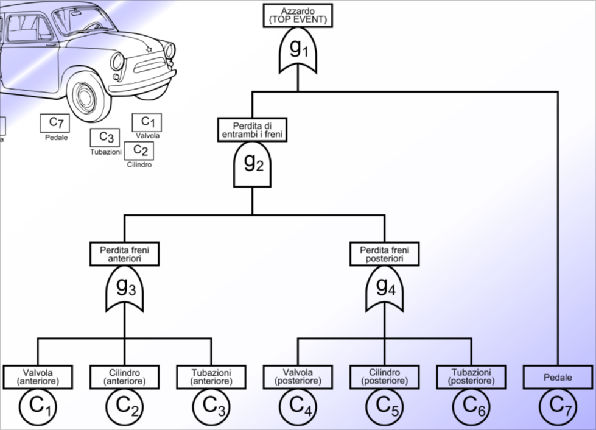

# Combinatorial approaches

This method allows to specify how each component of the system contributes to the behavior of the whole system both when it's working and when it's faulty.

## Main assumptions

- components fail **independently**
- components are restored **independently**

This is a strong assumption because we are saying that the failure of a component does not affect the failure of another component. If we think of a software with a bug it's easy to think that it may cause more than one component to fail in real life.

Other assumptions:

- if a component fails, it provides a wrong result
- the system is considered failed if the minimum number of components required to make it work fails
- if the system fails, other failures cannot restore it's behavior

*Note:* all these assumption might not be true in real life.

## Decomposition of the system

The system is decomposed into functional blocks that are functional. This decomposition depends on what we want to achieve, it might be needed to be more specific or avoid going into details depending on the granularity of the analysis that we want to do.

Decomposition can be done in different ways:

- **Functional decomposition**: the system is divided into functional blocks
- **Physical decomposition**: the system is divided into physical blocks

## Assigning probabilities

We consider a **Top event** as the event we want to analyze and a **basic event** as the event that contributes to the top event. We assign probabilities to the basic events and we can calculate the probability of the top event.

If we consider N **sequential** components:

$R_{series}(t) = R_1(t) \cdot R_2(t) \cdot ... \cdot R_N(t) = \prod_{i=1}^{N} R_i(t)$

If we consider N **parallel** components:

$R_{parallel}(t) = 1 - \prod_{i=1}^{N} (1 - R_i(t))$

### K out of n

In the case of K out of n, we consider the system working if at least K components are working out of the N total components of the system.
We consider the system as **G**, good if at least K components are working and **B**, bad if less than K components are working.

*Note:* viewing the **parallel** case we can see it as a 1 out of N. Viewing the **sequential case** we can see it as an n out of N.

**K out of N with the same distribution:** we suppose that all the components have the same probability of failing. We can calculate the probability of the system working as: $R_{K out of N} = \sum_{i=K}^{N} \binom{N}{i} R^i (1 - R)^{N-i}$

*Note:* this is the probability of the system working, to calculate the probability of the system failing we can do $1 - R_{K out of N}$.

## Boolean methods

In this case we consider a boolean algebra and some boolean variables that represent the state of the components.

The boolean function: $\phi:B^n \rightarrow B = {0,1}$ specifies how the top event depends on the basic events.

We rely on the **principle of inclusion-exclusion** to calculate the probability of the top event:
$P(\phi) = \sum_{i=1}^{n} (-1)^{i+1} \sum_{A \in \binom{B}{i}} P(\bigcap_{b \in A} b) = \sum_{i=1}^{n} (-1)^{i+1} \sum_{A \in \binom{B}{i}} \prod_{b \in A} P(b)$

Since we only have disjoint, the probability of the intersection of two basic events is zero so all the conjunction terms disappear.

*Note:* disjoint doesn't mean that the events are independent.

### Canonical disjuntive normal form

**Minterm:** a minterm is a product of literals in which each variable appears exactly once.
**Maxterm:** a maxterm is a sum of literals in which each variable appears exactly once.

The canonical disjunctive normal form is the sum of all the minterms that make the function true. It is a disjunction of minterms

The main reason why we use the canonical disjunctive normal form is that it is unique, this means that it's easy to verify if two expressions are equal.

*Note:* to transform a boolean function into the canonical disjunctive normal form we can use the **Shannon expansion Theorem**. Described in the slides but won't be asked in the oral exam.

## Graphical combinatorial formalisms

This approach is used in the case in which using the boolean combinatorial approach is not possible.

We define a **Path set** as a set of paths that lead to the top event. We can calculate the probability of the top event as the sum of the probabilities of the paths that lead to the top event.

We can use the **cut set** to calculate the probability of the top event. A cut set is a set of basic events that if they fail the top event fails.

### RBD (Reliability Block Diagram)

In the reliability block diagram, we represent the system as a graph in which we have a given number of blocks, a **sink** and a **source**.

We define the system as **working** if there at least a path from the source to the sink. The nodes in a path between a source and a sink is a **path set**.

We can obtain the **RBD** starting from the **minimal path set** or the **minimal cut set**:

- **Minimal path set**: for each minimal path we build a path from the source to the sink, composed by the elements in path in series.
- **Minimal cut set**: for each minimal cut we put in parallel elements that compose it.

### Reliability graphs

In the reliability graph, we represent the system as a graph in which we have a given number of nodes and oriented edges. We also have a source node and a sink node. There is an incidence function that associates a pair of nodes to each edge.

We can use an approach similar to the **RBD**. They can express more complex systems but have not immediate correspondence with boolean expressions.

### Fault trees

In this approach we represent the system as a tree in which the root is the top event and the leaves are the basic events. The internal nodes are the **gates** that represent the logical operations between the basic events.

*Note:* fault trees are often represented as logic circuits.

### Fault tree analysis

We start from a **minimal cut set** or a **minimal path set** and we build the fault tree. This is actually hard to get staring from a tree and error-prone and this is why we use FTA, which is an algorithmic way to obtain a minimal cut set.

We consider the **degree of a cut** as the number of basic events in the cut set. We can decide how critical a cat is based on his degree (low = highly critical).

**Algorithm:**

- First, we consider a single cut set containing the root
- We step top-down to the lower level
- Expanding the elements in the cut set according to the gates’ logic:
  - AND Gate: it is removed from the cut-set, while all the children are added
  - OR Gate: it is removed from the cut-set, creating multiple identical
cut-sets and adding to each of them one of the different children

## Case study: brake system of a car

We consider a simplified version of a braking system without considering the ABS system. The system is composed of a brake pedal, a brake pedal and two pairs of valvola, tubazione and cilindro (front and rear).

The **target** is to assess the likelihood of a dangerous event for the safety of passengers (**hazard**) due to a malfunction in the braking system.

We consider the following **hazard**:

- Loss of both the brakes

And we note that if one of the component in the front, the back breaks still work and viceversa, whereas if the brake pedal fails, the whole system fails.
All the failures are considered exponentially distributed.

### Modeling the system using a fault tree

$\phi = ((C1 \vee C2 \vee C3) \wedge (C4 \vee C5 \vee C6)) \vee C7$

*Note:* from here we can derive the minimal cut set using the algorithm seen in the previous lecture. Analyzing the minimal cut set is easy to identify the **single point of failure** by looking at sets that are made out of only one variable. Also we can identify that having one of the front component makes it so any of the rear component is also a single point of failure and viceversa.

*Note:* it's easy to define a RBD and a RG from here and it's also possible to apply the Shannon expansion theorem to find the probability of the hazard.

