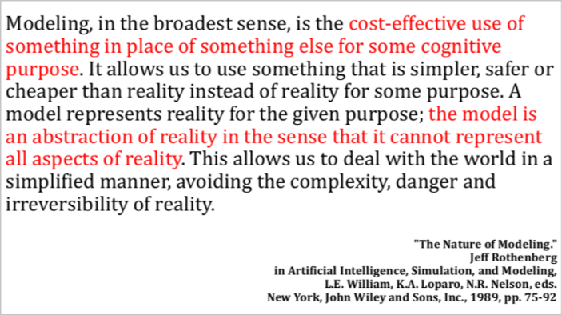
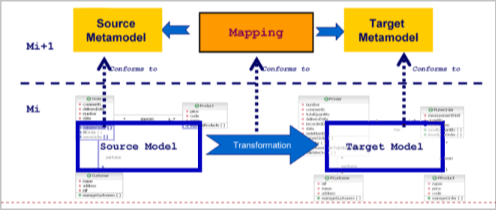
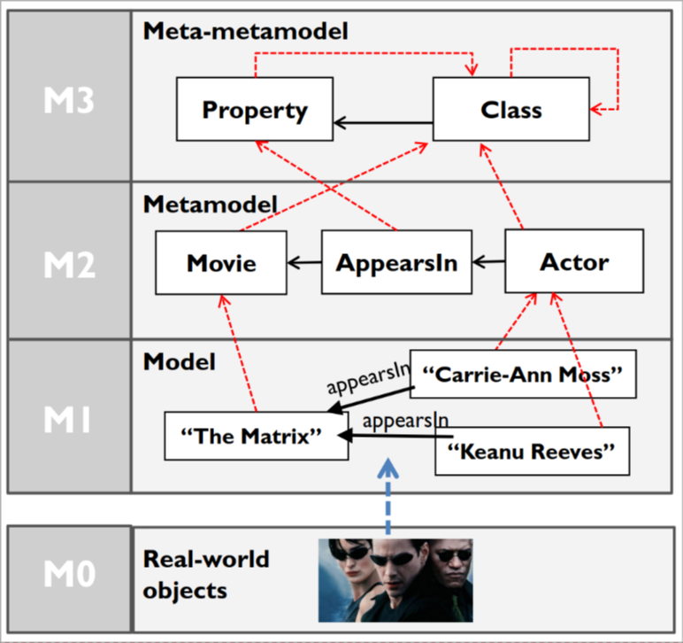

# Model driven engineering (MDE)

The reputation of code generators isn't really good. The basic idea is that you can use a generator to create the skeleton of the classes but after that if you modify the classes, the diagram is not going to be updated so it's useless.

**This is only a partial view**. We are going to talk about different kind of generators, we will use customizable, domain specific, languages and tools.

**DSL:** A DSL (domain specific language) is a language that is designed for a specific domain. This means that the abstraction and notations are suitable only for the stakeholders of that concern.

## Workflow

The workflow we are thinking about is the following:

- the user provides a specification of the system using a DSL.
- based on that model we can generate complex artifacts, including other models

The thing is that this is an over-simplification. In reality there are many things to take into consideration. In general everything that you can automatize through the use of DSL is something that you can also implement manually.

## Acronyms

There are multiple acronyms that are used in this field:

- **MDE:** Model Driven Engineering
- **MDA:** Model Driven Architecture
- **MDD:** Model Driven Development
- **MBE:** Model Based Engineering

Actually all of them represent more or less the same concept but they emphasize on different aspects.

## What is a model

There are many definitions that try to describe what a model is. (See the slides for all the definitions)

The basic idea is that a model should be able to answer a given set of questions in the same way the system would allow answering the same questions. *Note:* we usually consider a purpose for which the model is useful, *I.e:* a globe is able to tell us the distance between two countries without having to cross them, it's not able to show us the animals living in each part of the world.

The essential attributes are:

- **Reference:** it's a model of something
- **Purpose:** it's useful for something
- **Cost-effective:** it's cheaper to use the model than the real thing

**Definition:**

## Meta-models

A meta-model is a model of models. This definition isn't very specific but it's the most common one. The idea is that a meta-model is a model that describes the structure of other models, it defines what elements a class of models can have.

**Example:** UML is a meta-model that describes the structure of software models.

We can also have a **metaclass** that is a class that describes the objects that can be created starting from a specific meta-model, so an object of a specific model.

We say that a model **conforms** to a meta-model if it respects the constraints defined in the meta-model. We say that an object is **an instance of** a metaclass if it respects the constraints defined in the metaclass.

The meta-models are the basis of the MDE:

The meta-models are usually created using other meta-models (**Meta-meta-models**).

In the MOF specification this is the last level of meta-models. This is because we can say that the meta-meta-model conform to itself. (It is formally demonstrated, but we just think about the intuitive way).

*Example:*

We can see that the properties are some kind of classes so it's not needed to add another layer upper.

When we will have to transform a model into another model we will need to have the models A and B conforming to two meta-models which themselves conform to the **same** meta-model, otherwise the transformation is not possible usually.
