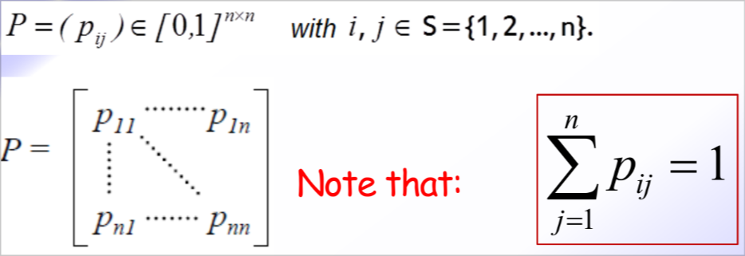
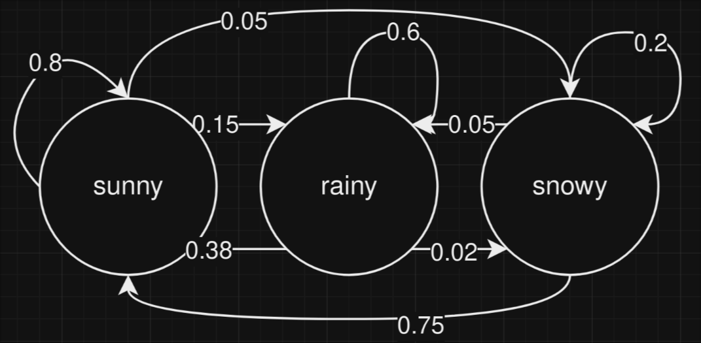

# More on Markov chains

## Transition probability matrix

We can compute the probability of going from state i to state j in k steps by using the **transition probability matrix** $P^{(k)}$ where:

## Transient behavior of a DTMC

If we want to evaluate the probability of finding the DTMV in state j at the step k we can procede as follows:

- we compute the $\pi_j(1)$ which is the probability of being in state j at step 1
- we realize that in order to calculate the $\pi_j(k)$ we need to know the $\pi_j(k-1)$
- $\pi_j(k) = \sum_{i=1}^{n} \pi_i(0) \cdot p_{ij}^{(k)}$

*Note:* in general $\pi(1) = \pi(0) \cdot P$, and $\pi(k) = \pi(0) * p^k$

*Example:* weather forecast

I consider the transition rate matrix:

$$P = \begin{bmatrix} 0.80 & 0.15 & 0.05 \\ 0.38 & 0.60 & 0.02 \\ 0.75 & 0.05 & 0.20 \end{bmatrix}$$

I want to know all the probabilities of the weather in 3 days.

I start with the graph:

From this I can calculate the probability of the weather in 3 days and also I can estimate which condition is most likely than the other in each day.

*Note:* I always need the initial state to calculate the probabilities in the future.

## Holding time in a state

The **holding time** in a state is the number of steps that the DTMC stays in a state before moving to another state.
The statistical properties still hold:

$$P(X_{t+k} = j | X_t = i) = P(X_{k} = j | X_0 = i)$$
