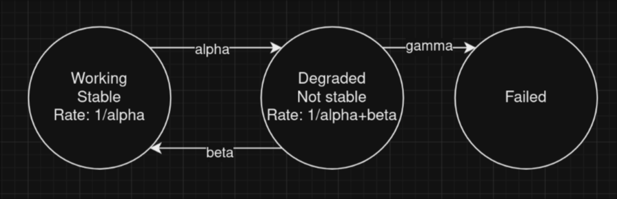
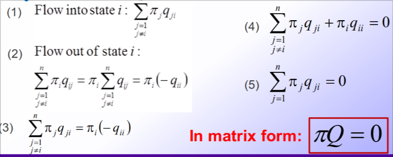

# More on Markov chain in the continous domain

## Transient behaviour of a CTMC

In case of a **homogeneous CTMC** we can write the following: $\frac{dP(t)}{dt}=P(t)Q$

Solving the equation can be hard, but it's necessary. There are mutliple ways, one of which is **uniformization**.

## Uniformization of Markov chains

The basic idea is to convert and approximate a continuos-time Markov chain to a discrete-time Markov chain

I consider the following: $P = I + \frac{Q}{\lambda}$. We note that we have a number which is greater than 0 and maximum 1 by considering $\frac{Q}{\lambda}$

What we get is an equivalent DTMC that includes self-loops, there are fictitious events that actually don't change the state i and represent the **extra time** spent on i.

## Absorbing vanishing and stable states

Given $T_i$ an exponential random variable that represents the hodling time in a state i in a CTMC:

$$P(T_i > t) =\begin{cases} e^{-a_it} & t \geq 0 \\0 & t< 0 \end{cases}$$

- if $a_i = 0$ then the state i is called **absorbing**
- if $a_i = \infty$ then the state i is called **vanishing**
- if $0 < a_i < \infty$ then the state i is called **stable**

*Note:* check the slides for the description of the example:

## Classification of the states

The classification of the states in the continuous domain is similar to the discrete domain, but we a few twists. Before that another definition is needed

### Embedded DTMC

Starting from the state transition rates Q:

- we define the quantity $q_{ij}$ as the rate of transition from i to j in one step:
$$q_{ij} = (\sum_{j\neq k, k}{q_{ik}})p_{ij}$$

- for each non absorbing state we have:
$$p_{ij} = \begin{cases} \frac{q_{ij}}{\sum_{j\neq k, k}q_{ik}} & i \neq j \\ 0 & i = j \end{cases}$$

Given this we can define:

- i and j are **communicating** if there is a path from i to j and from j to i
- an  embedded DTMC is **irreducible** if all the states are communicating
- a state in a CTMC is **recurrent** if the state is **recurring** in the embedded DTMC
- in a finite irreducible CTMC all states are **positive recurring**
- an irreducible CTMC where all the states are **positive recurrent** is called **ergodic**

*Note:* an irreducible homogeneous CTMC is positive recurring if and only if a non-negative solution $W = (w_1,w_2,\dots)$ of the following system exists:
$$\begin{cases} WQ = 0 \\ \sum_{i}w_i = 1 \end{cases}$$

In case of ergotic we have: $\pi = \pi \cdot P$ so:
$$\begin{cases} \pi Q = 0 \\ \sum_{i}\pi_i = 1 \end{cases}$$

### The flow equations

- The probability mass flow in a state i must be equal to the probability mass flow out of the state i
- The probability of mass flow from i to j is $\pi q_{ij}$ which represents the probability of being in i times the rate of the transmission from i to j.

### Computation of $\pi$

There are many ways to compute $\pi$:

- **Direct methods** (like Gauss elimination method)
- **Iterative methods** (methods that converge to the solution)
