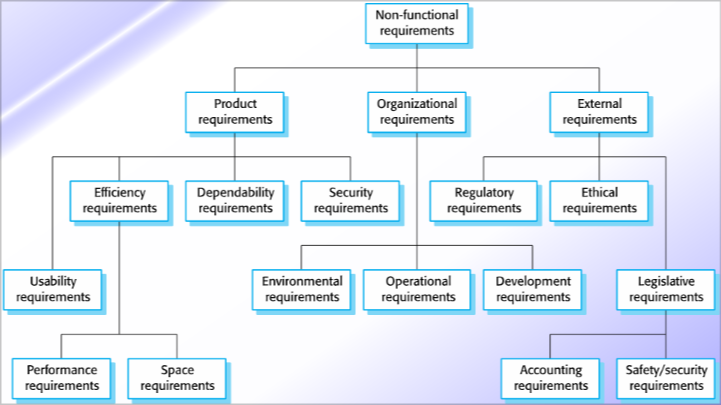
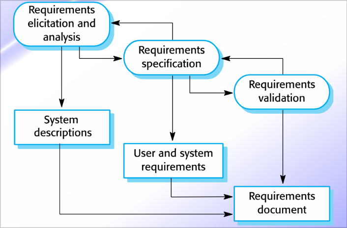
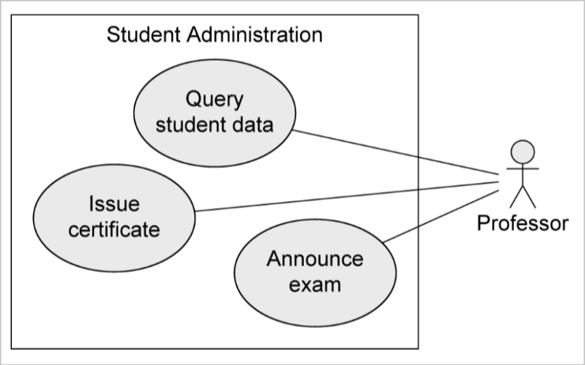

# Requirement engineering

## Requirements

Requirement are a **specification** for the new system. (*Note:* it's like a contract that the customer and the developers agree on)

Requirements can be classified in two categories based on who is interested by them:

- **User requirements:** these are high-level requirements that describe what the system should do. They are written for the customers and end-users.
- **System requirements:** these are detailed requirements that describe the functions, features, and constraints of the system. They are written for the developers to work on, but the customer could also review them.

Requirements can also be classified based on what they describe:

- **Functional requirements:** these are requirements that describe what the system **should** do. They are written in the form of "The system shall do X".
- **Non-functional requirements:** these are requirements that describe **how** the system should do something. They are written in the form of "The system shall be X".

*Note:* in general the non-functional requirements are the ones that generate the most of the work. Cause they make the code a lot more complicated if we want to respect them. (*I.e:* they can be about security, performance, smoothness, availability etc.)

A problem in **non-functional** requirements is subjectivity. The non-functional requirements cannot be subjective, for instance I cannot try to evaluate if a UI is **pretty** or **good**.

## Requirements engineering

The **requirements engineering** is the process of defining, documenting, and maintaining the requirements in the engineering process. The main reason why it's needed is that bad requirements are one of the main reason why projects fail, which means that we should detect the errors in requirements should be identified before implementing the system based on those.

*Note:* requirement elicitation is not as easy as it seems. It's not just about asking the customer what they want, but it's about understanding what they want and what they need. Sometimes the customer don't even know what they want themselves.

### Use-case diagram for requirements elicitation

The **use-case diagram** is a diagram that describes the interaction between the user and the system. It's pretty straightforward which means that even clients that are not into IT can understand it and evaluate it.

In a use-case diagram we have:

- **Actors:** these are the entities that interact with the system. They can be human or other systems (or any other kind of entity that can interact with our system). Actors can be divided into **primary**, **secondary**, **active** or **passive**
- **Use-case:** these are the functionalities that the system should provide. They are represented as ovals in the diagram. They are the actions that the system should do in order to satisfy the user requirements.

The **use-cases** should NOT be connected based on the workflow. They can still be connected in some cases:

- **Include relationship:** this is a relationship that connects two use-cases when one use-case includes the other. (*I.e:* the use-case "send email" includes the use-case "login")
- **Extend relationship:** this is a relationship that connects two use-cases when one use-case extends the other. (*I.e:* the use-case "send-pec" extends the use-case "send-email"). In this case if we consider A that extends B, is A that decides if B needs to be used or not.

*Note:* a use case could also be **abstract** which means that we need another use-case to make it work and use it.

*Note:* actors can also be connected between them. (*I.e:* a user can be connected to a system and a system can be connected to another system) Also if a user is interacting with a part of the use-case diagram that is connected to other use-cases that the user can also use, it's not needed to connect the user to this other cases (it's a best practice not to do it)

#### Some best practices

- **Use case diagram do not model the workflow:** the use-case diagram should not be used to model the workflow of the system. It should be used to model the functionalities of the system. Using it to model the workflow it's not wrong in the sense that you are not going to go against any rule of the use-case diagram BUT you should not use it for this purpose.
- **Actors should be external to the system:** the actors should be external to the system. This means that the actors should not be part of the systems, they are use or are used by the system.
- **You should use summarizing use-cases:** the use-cases should be summarized. This means that you should not go into the details of the use-case in the diagram if they become too complicated and/or require to model the workflow.
- If two actors can access the same use-cases, you should make them communicate instead.
- **You should not do any functional decomposition**

### System requirement specification

There are multiple ways to write the **system requirement specification** like the **natural language**, the **mathematical specifications**, **structured natural language** and **graphical notations**.

*Note:* the mathematical notation is usually really good and efficient, but it's really hard to understand and use in reality.

*Note:* there are some guidelines that should be followed when writing the system requirement specification. In some of the ways that we have available they are more strict, in others they are more flexible.

#### Natural language

##### MAY SHOULD MUST

- **MAY:** this is a requirement that is optional. It's something that the system could do but it's not mandatory.
- **SHOULD:** this is a requirement that is not mandatory but it's highly recommended. It's something that the system should do but it's not mandatory.
- **MUST:** this is a requirement that is mandatory. It's something that the system must do.
- **SHOULD NOT:** this is a requirement that is not mandatory but it's highly recommended to not do it.
- **MUST NOT:** this is a requirement that is mandatory to not do it.

*Note:* the **SHOULD NOT** and **MUST NOT** shouldn't be used much, as usually it's better to use the positive ones instead of the negative ones.

##### SMART requirements

- **Specific:** the requirement should be specific. It should not be vague.
- **Measurable:** the requirement should be measurable. It should be possible to measure if the requirement is satisfied or not.
- **Achievable:** the requirement should be achievable. It should be **technically** possible to achieve the requirement.
- **Realistic:** the requirement should be realistic. It should be possible to achieve the requirement **in the real world**.
- **Traceable:** the requirement should be traceable. It should be possible to trace the requirement back to the user requirements.

#### Structured specification

The **structured specification** is a way to write the system requirement specification that is more structured than the natural language. It's not very different, but there are rules and **keywords** that we use to represent what a specific statement is talking about.

#### Tabular specification

This is another way to **supplement** natural language. It's useful if we need to define a number of possible alternative courses of action.

#### Graphical notation

We can use **SySML** to represent the system requirement specification. (*Note:* more on this in the slides)

*Note:* this kind of diagram is probably the best one but it's still not a decent solution actually. It has many problems and some other good management tools doesn't use SysML (*I.e:* IBM DOORS, RQA)

#### For the project

Check the template, and fill it (**it will be filled in class during the course for the most part**)
