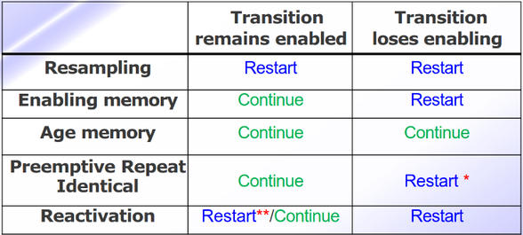

# Priority and timed Petri nets

## Priority Petri nets

Priority PNs are obtained from the P/T Petri nets with the addition of:

- **priority**: a positive index associated with each transition
- **inhibitor arcs**: arcs that prevent the firing of a transition if the place is marked
- **inhibitor places**: places that prevent the firing of a transition if marked

### Priority and inhibitor arcs

The **priority and inhibitor arcs** change the enabling conditions of the transitions.

Informally:

- In every marking all the transitions with the bigger priority maybe be enabled while all the other transitions are not enabled.
- A transition may be enabled if and only if there are empty inhibitor places or inhibitor places with a number of tokens that is lower than the weight.

Formally:

1. The number of tokens in each place of input of t is greater or equal than the weight of the input arc that connects to the place to t
2. The number of tokens in each inhibitor place of t is lower than the weight of the inhibitor arc that connects the place to t
3. There are no other transitions with a priority greater than t that satisfy the two previous conditions.

If 1 and 2 are satisfied, the transition has **concession** to fire. A transition is enabled if it has concession and has the biggest priority.

### New firing rule

A transition may fire if and only if:

- It's enabled
- The firing of that transition modifies only input and output placed of t
- The firing of a transition t adds token to an inhibitor place of t only if it is also an output place

*Note:* using priority we can establish a deterministic criterion to solve conflicts and also confusion.  

### P/T vs Priority vs Inhibitor

In the P/T petri nets I cannot model the **zero tests** so with the priority ones I'm actually increasing the power of the net.

It's possible to implement a model with **inhibitor arcs** using **priority** and vice-versa this means that both conventions are usually kept just as a modelling convenience. Sometimes it's very inconvenient and hard to read a model that uses only one of the two.

It should be noted that even if the two are formally equivalent if we look at the modeling power they are not equivalent in the **efficiency of modeling**.

### Locality

Locality is a property for which the definition and the behaviour of a component depends only on the components that are graphically and directly related to the component itself. As a result:

- an inhibitor arc influences only on the enabling condition of the transitions which are directly connected and the influence on the PN is graphically local
- the firing of a transition may be affected by the priority of any other transition, also if not graphically in its neighborhood

The inhibitor arcs guarantee the locality while the priority arcs do not. Both may impair the locality of conflicts, generating indirect conflicts.

## Timed Petri nets

Timed PNs are obtained by combining a local delay at every transition and a global time of the PN.

Each transitions has a **timer**. When the transition is activated then the timer is set to an initial value of d. The timer is decremented with a constant speed. When the timer reaches 0 then the transition fires.

*Note:* the tokens are still in the input places as long as the transition is enabled, only when it fires they are removed from input places and put in the output places.

A sequence of timed transitions is defined as $(t_{k_1}, T_{k_1}), ..., (t_{k_r}, T_{k_r})$ where T are the transitions and t are the firing instant of the corresponding transition.

An interval of time between two subsequent firings can be seen as $[t_{k_i}, t_{k_{i+1}})$

*Note:* the transition should also be enabled during the whole local delay period. If during that delay time the transition becomes no longer enabled then the transition won't fire.

### Interpretation

In this case when using these PNs we should have a specific idea in mind. In particular we can think of having something that is time dependent and we want to model the time dependency of the system.

**Duration of activity**: value associated to the transition when it's enabled
**Execution of the activity**: transition is enabled
**End of the activity**: transition is fired
**Interruption of the activity**: transition is disabled

*Note:* this means that ofc the transition may recover if the transition is enabled again.

### Memory mechanism

At every transition firing one of these two mechanisms can be adopted to set the timer:

- **continue**: the timer keeps the current value and continues following the countdown
- **restart**: the timer resets, which means that the current value is discarded and a new one is generated (if needed)

These two options are called **memory policies** and are applied to keep track of the past.

### Resampling

This strategy works as follows:

- The timer of an enabled transitions resets on every firing of any other transition
- A new value of the timer is generated if, the new marking the transition is still enabled.

### Enabling memory

This strategy works as follows:

- if in the new marking T is still enabled, the timer of an enabled transition T keeps the current value
- If in the new marking T is disabled, the timer of an enabled transition T is reset and a new value is generated when needed.
- There is an **enabling memory variable** that is associated to every transition and measures the time the transition has been enabled starting from the last activation instant.

### Age memory

This strategy works as follows:

- At every firing of a transition the timer keeps the current value also when aborting
- An age memory variable associated to every transition measures the cumulative enabling time of the transition starting from the last instant in which it fired
- The memory is lost only when the transition fires

### Preemptive repeat identical

This strategy works as follows:

- When a transition is aborted we don't keep track of the current value of the timer, we keep the initial value
- If T is enabled with a firing time d, is disabled before of firing then the novel time to fire of T when it will be enabled again will still be d
- Again we loose memory only when the transition fires.

### Reactivation

This strategy is similar to resampling but with a difference, this is not applied to every firing of a transition. The timer of an activated transition T is reset only when:
> T was activated in a marking in which the activation predicate was valid and the firing of another transition generates a marking in which the reactivation predicate is valid and in which T is still enabled.

### Summary of all the memory policies

\* the timer resets to the initial value, d  
** depends on the marking(activation/reactivation **predicates**)
