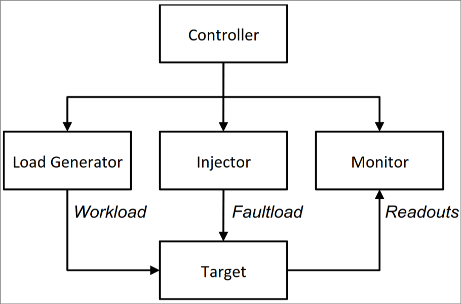
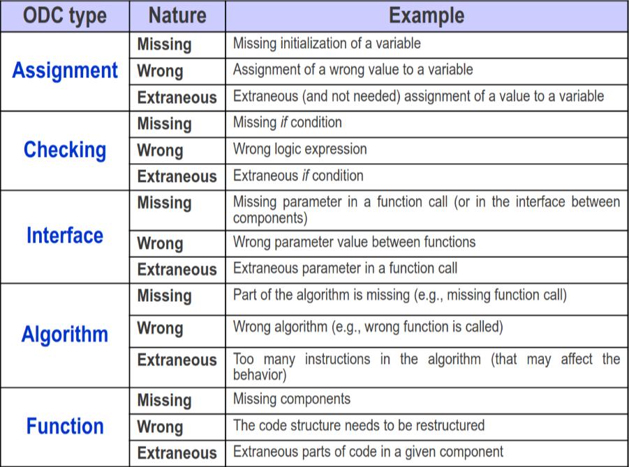
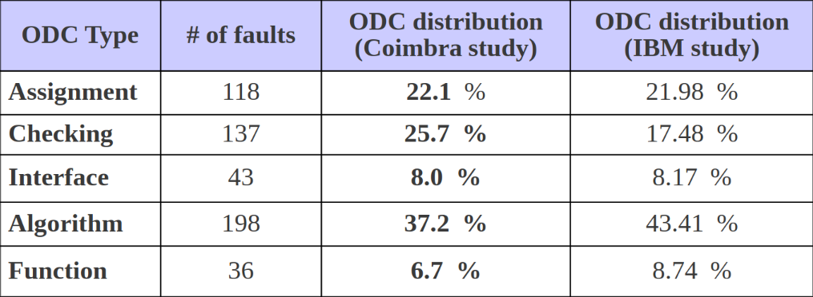

# Perchè fare monitoring

Nella lezione precedente abbiamo visto come funziona il monitoring. Tuttavia occorre notare che nessuno ci paga per fare la parte di monitoring, questo significa che dobbiamo farla soprattutto per noi stessi.  
Nella pratica si esegue il monitoring per capire se c'è qualcosa di pericoloso che potrebbe succedere (o sta già succedendo) nel tuo sistema.  
*Esempio:* si considera qualcosa tipo top in cui di vedono diversi processi, la quantità di CPU che utilizzano e il loro PID. Posso capire che se la CPU va sopra una certa soglia c'è qualcosa che non va, però questo non è detto. In una situazione reale non c'è modo di capire quando c'è un attacco da parte di un virus in corso. La prima cosa che potrei pensare è di vedere come si comporta il sistema durante un attacco e a quel punto imparare dalla situazione ed evitare che si verifichi di nuovo.

**Problema dall'esempio precedente:** potrebbe succedere che tu non venga attaccato per un lungo periodo, puoi aspettare per anni? Di solito no.

**Soluzione:** fare accadere i problemi manualmente. **fault injection** (iniezione di fault).  
Grazie allo studio del sistema ottengo un **fault model**.  
*Nota:*  il fault model può essere ottenuto sia analizzando dei reali attacchi che utilizzando la fault injection perchè entrambe le metodologie permettono di ottenere dati.

## Fault injection

È chiamato così l'atto di inserire manualmente dei fault nel sistema. Il punto fondamentale è che devono già essere presenti dei sistemi di monitoring prima che si inizi a fare questo processo, alternativamente non si ottengono informazioni.  
Tipologie di fault injection:

- **Hardware fault injection:** si iniettano fault a livello hardware. *Esempio:* costringo un registro ad avere uno specifico valore
- **Software fault injection:** si iniettano fault a livello software. *Esempio:* modifico un software che utilizza il mio software di modo che lo utilizzi male, e osservo cosa questo causa.

**Nota importante:** quando si parla di fault injection può anche capitare di pensare ad alcuni fault da iniettare che in realtà non hanno senso.  
*Esempio:* non uso il mio computer per fare coding, ma testo cosa succede se Eclipse si comporta male e ruba tutte le risorse.  
*Altro esempio:* devo capire perché Firefox crasha, non ha senso che io decida di modificare qualcosa al livello hardware.

**Fasi della fault injection:**  
per prima cosa occorre premurarsi di analizzare un caso in cui il fault causa effettivamente un error. Se questo non succede la mia injection non mi permette di testare cosa succede in caso di errore.  
*Ricordiamo:* esempio della corrente che non va, se nessuno entra nella stanza di sicuro nessuno si farà male per colpa di quella luce.

## Schema di un esempio di fault injection

Alcune cose da notare.  
La parte di workload sta ad indicare che io devo testare il fault durante il normale workload (carico di lavoro) di modo da vedere cosa accade in quello specifico caso.  

## Fault model

La definizione di un modello di fault è necessaria quando non c'è già un modello adeguato per il sistema.  
*Esempio:* un cliente viene da noi e ci chiede di gestire il monitoring del suo sistema specifico.  
Ci sono due parti fondamentali da capire per creare il modello:

- **Field Failure Data Analysis (FFDA):** si analizzano i dati di fallimento del campo. A volte questa tecnica è complessa perché magari il failure si verifica raramente o in modo del tutto casuale (almeno in apparenza) *Esempio:* se un sistema è già in produzione e ha già avuto dei problemi, posso analizzare i dati di quei problemi per capire cosa è successo. *Esempio specifico:* un'azienda ci dice che durante uno specifico periodo di tempo tutti i giorni alla stessa ora il sistema funziona male, devo cercare di capire perché. Eseguo questa verifica identificando innanzitutto quando succede di specifico e poi andando a guardare cosa succede nel sistema in quel periodo di tempo in effettivo.
- **Failure Modes and Effects Analysis (FMEA):** si analizzano i modi in cui il sistema può fallire e gli effetti che questi fallimenti possono avere. In questo caso si parte da uno specifico failure che pensiamo si possa verificare, proviamo a vedere cosa succede se il fault in effetti succede. (Ovvero provo a vedere se ci sono delle cause che potrebbero causarlo e provo a farle avvenire) *Esempio:* ho paura di cosa accade in caso di un attacco DDOS, attacco il mio sistema con un DDOS.

## Chip defects

Un esempio che sembra poco aderente alla realtà, ma può capitare, è la possibilità che il sistema fallisca per colpa di problemi sui chip. In realtà questi a volte potrebbero verificarsi e sono difficili da identificare perché non viene in mente che questo possa essere un problema.

## Bugs

Il termina bug prende il nome da un vero insetto che ha causato quello che è stato definito come il primo bug. Una farfalla era rimasta incastrata fisicamente tra i resistori in quel caso.  
Chiaramente oggi vediamo dei bug di natura completamente diversa.  
I bug comunque solitamente una volta identificati sono piuttosto facili da risolvere, ciononostante se non vengono trovati potrebbero portare a conseguenze catastrofiche. *Esempio:* un F-18 è caduto perchè aveva una condizione di else vuota dato che si pensava che quella specifica condizione non potesse mai verificarsi, e invece si è verificata.

A volte i bug si verificano durante degli **aggiornamenti**, per esempio se passo da un processore a 32bit verso uno a 64, ci sono alcuni specifici edge case che potrebbero andare diversamente da quello che si aspettiamo.

## Orthogonal Defect Classification (ODC)

Spesso gli errori nel software nascono da alcune cause veramente basilari. *Ad esempio* potrebbe essere che semplicemente si sia fatto un copia incolla dimenticandosi di cambiare le parti necessarie perchè sovrappensiero.

Si nota che degli studi fatti nel 2006 ma ancora recenti "Emulation of software faults..." mostrano che ci sono alcune tipologie di fault nei software che superano come frequenza tutti gli altri di una quantità molto grande.
Da tutti i possibili fault:

Si è notato che la distribuzione vedeva le seguenti percentuali:

Andando più nello specifico si è notato che i 12 fault più comuni in effetti coprivano il 50% dei bug totali.

## Essere sicuri che il mio fault injection funzioni

The easy way to understand if my injection is working is by injecting the code by checking which lines your code is calling and injection specifically in those lines. Ci sono casi in cui questo non è però possibile perché come abbiamo detto a volte il software da monitorare è una black box.  
In questo caso occorre forzare dall'esterno il componente in uno stato di errore.  
**Error injection:** nel caso sopra descritto si parla di **error injection** perché sto direttamente andando ad inserire un error, non un fault.  
Qualunque tipo di errore io consideri, comunque devo analizzare come reagisce il mio sistema.  

## Robustness testing

Il robustness testing si fa nei sistemi che sono basati su componenti e l'error injection può corrompere in qualche modo anche le interfacce. Questo è l'unico modo per testare i sistemi che sono delle black box.

**Robustness testing vs Fault injection:**
Il punto fondamentale è che di solito nella fault injection si cambiano gli output (e anche gli input volendo) mentre nella robustness test si cambiano solitamente gli input per vedere cosa succede negli altri componenti.

Il punto fondamentale del robustness testing è cercare di capire se ci sono alcuni input che possono effettivamente causare problemi al sistema e che simulano degli input che in effetti qualcuno di malevolo potrebbe decidere di inviare al nostro sistema. *Esempio:* il sistema si aspetta un integer, io provo a mandare un NAN oppure una stringa e vedo se si comporta in modo corretto per rispondere a questo input errato (e magari malevolo).

Alcuni esempi di robustness testing:

- **Fuzz testing:** si mandano input random al sistema per vedere come si comporta. Questo è un test molto semplice ma che può dare risultati molto interessanti.
- **Bit-flip:** si cambiano uno (o più) bit in modo casuale per vedere cosa succede. Questo è un test molto interessante perché può simulare un errore hardware.
- **Data based type:** si mandano dati che non sono del tipo corretto per vedere cosa succede. *Esempio:* se il sistema si aspetta un intero, io mando una stringa.

Di solito questi test utilizzano una scala per decidere quanto è importante il crash che viene causato chiamata **Crash scale**:

- **Catasrophic:** il sistema non funziona più, l'app diventa corrotta o la macchina si riavvia da sola
- **Restart:** l'applicazione si pianta e deve essere riavviata
- **Abort:** l'applicazione termina in modo anomalo
- **Silent:** l'applicazione continua a funzionare ma non fa quello che dovrebbe fare
- **Hindering:** l'errore ritornato non è quello che ci si aspettava

*Nota:* se viene ritornato l'errore corretto allora il test è passato e non c'è alcun tipo di crash da misurare nella crash scale.  
*Nota:* alcuni esempi di input che si usano per robust testing presenti nelle slides.

## Security vulnerabilities

Il robustness testing può tornare utile anche per verificare delle vulnerabilità si sicurezza. *Es:* una SQL injection.  
Questa vulnerabilità di base si trova andando a cercare di iniettare delle SQL injection e vedendo come si comporta il sistema in risposta.
