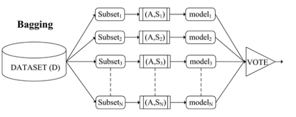
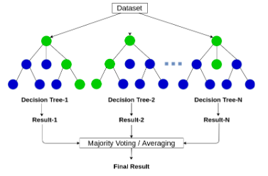
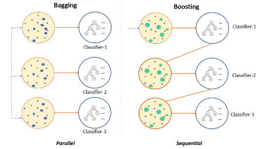
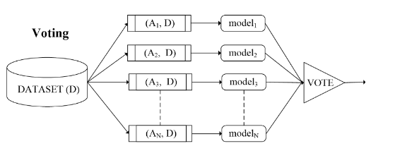
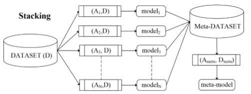

# Meta learning

Nelle precedenti lezioni abbiamo detto che gli algoritmi di *supervised* and *unsupervised* *learning* funzionano bene in casi diversi (dati con label o senza label). Per questo motivo il metodo migliore è utilizzare insieme classificatori che funzionano bene nei due casi in modo da ottenere degli algoritmi che funzionano ottimamente su classi di dati variegati.

*Nota:* prossimamente in laboratorio vedremo come utilizzare questi metodi insieme nella pratica e poi passeremo al deep learning per immagini.

## Insiemi (Ensembles)

Di solito quando pensiamo alle decisioni, queste sono prese da insiemi (**Ensembles**)*Es.* elezioni politiche

### N-version Ensembles

L'N-version programming è una tecnica di programmazione in cui più versioni dello stesso programma sono scritte in modo del tutto indipendente. L'obiettivo principale è avere una ridondanza di modo che se una versione fallisce è comunque probabile che le altre continuino a funzionare dato che sono scritte in modo del tutto indipendente (logica diversa, linguaggio di programmazione diverso ecc.)

*Esempio:* considero in un aeroplano. Se ho un solo sistema di controllo e questo fallisce, l'aereo si schianta, mentre se ne ho un secondo che continua a funzionare, potrà entrare in utilizzo ed evitare il peggio.

Un altro modo in cui si utilizzano queste diverse versioni è con il **voto**. A seconda della votazione delle diverse versioni può venire presa una decisione.

### Ensembles in machine learning

In machine learning si utilizzano diversi classificatori per poi andare a fare una votazione. Questo metodo è chiamato **Ensemble Learning**. L'idea è che diversi modelli vengano utilizzati per fare la stessa valutazione e successivamente si proceda a confrontarli e ottenere una singola valutazione più precisa.

*Esempio:* uso k-means e DBSCAN per fare clustering e successivamente faccio una votazione per cercare di determinare il risultato nel migliore dei modi.

## Meta learning

Dato quello scritto sopra, possiamo dire che il **Meta learning** è un metodo di apprendimento che si basa sull'idea di utilizzare diversi classificatori per poi fare una votazione. Questo metodo è molto utile per migliorare la precisione dei classificatori.

**Meta-learning:** è lo studio di metodi che permettono di ottenere meta-conoscenza per ottenere modelli e soluzioni basati su machine learning e data-mining.

Un **meta-learner** è un modulo di machine learning che si basa su un precedente studio fatto sui meta-dati in modo da migliorare le capacità di classificazione.

*Nota:* diamo per scontato che confrontando diversi classificatori si ottenga un aumento della precisione.

Un **base-learning process** comincia a dare al dataset delle feature in uno o più algoritmi di learning per riuscire ad estrapolare uno o più modelli da utilizzare per la classificazione in questa prima fase. I risultati dei base-learners sono dei metadati da cui, utilizzando anche altri meta-dati conosciuti, si va a ad ottenere la classificazione decisa dal meta-learner.

### Meta-Features

- feature note, che possono essere normalizzate e date al learner
- feature statistiche
- feature Information-theoretic, che possono essere calcolate con metodi di information retrieval in modo da capire l'importanza delle singole feature
- feature Landmark, che determinano in quale parte del dataset il base-learner funziona meglio
- feature Model-based, che sono basate sul modello di base-learner.

#### Categorie di meta-learners

- **Bagging**
- **Boosting**
- **Stacking**
- **Cascade**
- **Delegated**
- **Weighted (voting)**

### Bagging

In questa tecnica si combinano più base-learner dello stesso tipo e poi si inviano delle repliche bootstrap al train set. Il risultato finale è determinato da una votazione finale di ogni base-learner, che compie lo stesso algoritmo, ma con un sottoinsieme di date differente, generato in maniera casuale. 

*Esempio:* Random Forest è la tecnica più usata di bagging. Altro esempio è usare Knn con diversi insiemi di feature.

Di solito i singoli learner vengono addestrati su diversi insiemi di feature e poi quando deve essere presa una scelta vengono analizzate le risposte dei diversi base-learner. 
*Esempio:* se considero una scelta binaria e la maggioranza vota per il no viene scelto il no.

### Boosting

Si basa sul concetto dei **weak-learner** (*modello di machine learning con prestazioni predittive leggermente migliori del caso casuale*). 

*Esempio:* ho degli insiemi di dati e devo classificarli con una label nell'insieme $\set{1,2,3,4}$ o Knn che funziona bene per trovare i dati che appartengono alla categoria $1$ ma non nelle altre, e ho altri modelli che funzionano bene nell'identificare le altre classi singolarmente. Da solo nessuno è buono a classificarle tutte e di conseguenza si dice che sono tutti dei **weak-learner**.

Un weak-learner è un classificatore che funziona bene per alcune classi, ma **NON** per tutte. Di conseguenza l'idea di boosting è quella di combinare più weak-learners.

Di solito gli strong classifier vengono addestrati sulle parti del dataset che gli risultano più difficili da identificare di modo che possano migliorare. Si può cercare di tarare il comportamento dei singoli week classifier che lo compongono.

Utilizza i pesi associati a ciascun punto dati nel set di addestramento per creare un sottoinsieme di addestramento per ciascun weak learner, cioè uno **stump decisionale**.  
- I weak learner sono alberi decisionali.  
- Ogni weak learner ha un "peso" o una reputazione, il che significa che non tutti gli stump decisionali (weak learner) hanno lo stesso ruolo nel calcolo della classe finale.

*Esempio:* AdaBoost è un esempio di boosting. La versione più usata è **AdaBoost M1** che è usato per trovare le anomalies. Vengono identificati dei buoni weak learner per diversi insiemi di feature, ogni weak learner è un albero di decisione. Ogni weak learner ha una certo valore nel suo voto, questo vuol dire che non tutti i **decision stumps** hanno lo stesso potere (**reputation**) nel prendere la decisione finale. Questo permette anche di cambiare i singoli pesi degli alberi se notiamo che il classificatore non si comporta molto bene. Di solito la reputation viene decisa facendo dei cicli di test in cui si va a valutare quanto ogni weak learner si comporta bene in situazioni specifiche. Un altro esempio è **XGBoost**

#### Bagging vs Boosting

Nel **Bagging** abbiamo diversi classificatori che lavorano in parallelo e poi si fa una votazione. Nel **Boosting** invece si lavora in serie e si va a modificare i pesi dei classificatori in base al loro comportamento.

## Meta learning con classifier di tipo diverso

Gli algoritmi sopra elencati si basavano tutti sull'utilizzo di classificatori dello stesso tipo. In realtà si possono utilizzare anche classificatori di tipo diverso su diversi insiemi di feature.

### Voting

Un esempio di algoritmo in cui si utilizzano classificatori di tipo diverso è il **Voting**. In questo caso parliamo di una tecnica di voting in cui diversi modelli vengono allenati sullo stesso dataset. Viene fatta una votazione da cui poi si prende una decisione.

Ci sono diversi modi per prendere una decisione, ad esempio si potrebbe andare per maggioranza oppure si potrebbe anche porre un **treshold** (limite) sopra il quale viene presa una decisione specifica. 
*Esempio:* devo identificare delle anomaly, se almeno 7/10 algoritmi dicono che un dato è un'anomaly dirò che lo è, altrimenti no.

#### K-o-o-N voting

Il modo con cui di solito si esprimono questi classificatori è utilizzano questa notazione (K out of N) dove:

- N è il numero dei votanti
- K è il numero minimo di classificatori che devono essere d'accordo per prendere una decisione

*Nota:* se K è alto si dice che il detector è **very** **suspicious** (molti FP e pochi FN), se è molto basso si dice che è poco **less suspicious** (pochi FP e molti FN).  
*Nota bene:* come detto sopra in questo caso tutti i classificatori utilizzano **TUTTO** l'insieme di feature, non insiemi diversi

### Weighted voting

Una variante di questo algoritmo utilizza il **Weighted voting**. Come per Adaboost si parla quindi di modelli con diversa reputation. Si va a valutare quanto bene ogni algoritmo funziona in casi specifici e dopodiché si assegnano dei pesi al loro voto.

Dati un data point $d$, un insieme $C$ di classificatori e una reputazione rep (|rep| = |C|), dove
$$Count(C,d)=\sum_{c_i \in C}c_i(d)$$$$WeightCount(C,rep,d)=\sum_{c_i \in C}{rep_i*c_i(d)}$$
### Stacking

Nello stacking si va ad utilizzare un algoritmo machine learning per analizzare i voti di altri algoritmi. Questo è utile perché a volte usare semplicemente una somma di valori di voti risulta non sufficiente e porta a troppi errori.

In questo caso parliamo di un **base-layer** e un **meta-layer**. Il base-layer è composto da diversi classificatori che vanno a votare, mentre il meta-layer è un classificatore che va a valutare i voti dei classificatori del base-layer. I due layer sono ben distinti.

**Problema:** in generale si potrebbero avere troppe poche feature affinché il meta-layer possa lavorare correttamente.

**Soluzione:** il meta-layer analizza anche i dati del dataset originale in quella che è chiamata **stacking generalization**. 
*Nota:* in questo caso il meta-layer potrebbe usare alcune feature del dataset originale o anche tutte. Di solito si vanno a scegliere quelle che sembrano produrre i migliori risultati statisticamente.

### Cascading

Nella letteratura si trovano altri algoritmi che che si basano sui concetti sopra espressi ma andando a lavorare in modo ancora più complesso combinando diversi approcci.

Nella tecnica **cascading** si segue l'approccio già visto in boosting ma si vanno ad utilizzare dei modelli eterogenei sulle diverse parti del dataset.

### Delegating

In questo approccio diversi classificatori eseguono la stessa task, classificano un datapoint ed ognuno restituisce anche la sua confidenza sul risultato. La decisione viene lasciata al primo classificatore che viene analizzato che ha una confidenza abbastanza alta da essere accettabile. In generale in questo tecnica si analizzano in modo sequenziale molti classificatori fino a trovarne uno che risulta sufficientemente confident.

Se nessun algoritmo riesce a dare una risposta sufficientemente confidente si può decidere di non dare una risposta, oppure si può decidere di prendere semplicemente quello più confidente fra i diversi algoritmi anche se nessuno sembra sufficiente. O ancora si può semplicemente prendere l'ultima valutazione fatta.

Questa strategia è molto usata in alcuni casi specifici.  
*Es.* io uso di solito Knn, ho altri classifier come ad esempio una neural network che impiega molto tempo a decidere. Io provo ad usare Knn e poi se il risultato non è sufficientemente confident allora proverò ad usare la rete neurale anche se impiega molto tempo.

## In conclusione

Di soltio i meta learner sono più costosi in termini di tempo ma riescono anche a raggiungere precisioni più alte, per questo motivo ad oggi sono molto usati. Quelli più comuni sono i metodi **bagging** e **boosting**.

Con questa lezione si conclude l'analisi di dati tabellari, dalla prossima vedremo analisi di dati che sono in forma di immagini.
