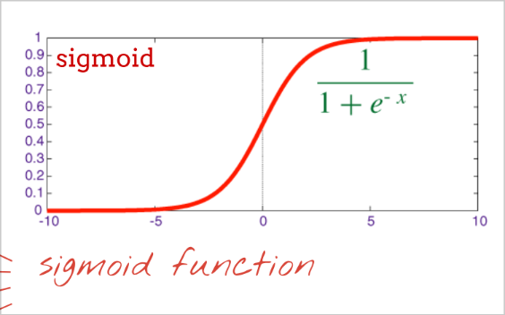
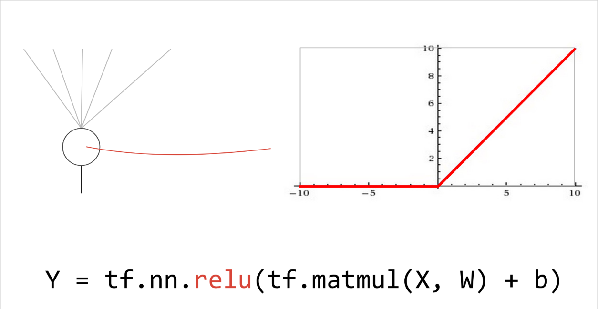

# Deep learning

Il deep learning è molto usato in situazioni reali come ad esempio il riconoscimento di macchine nella strada partendo da una ripresa video. In generale questa tecnologia è molto usata nel riconoscimento di entità all'interno di video. Ad oggi la tecnologia non è ancora perfezionata e questo vuol dire che a volte vengono commessi degli errori e questo può causare delle conseguenze (*Nota:* a volte queste sono di poca importanza o addirittura divertenti, altre volte possono essere molto importanti e portare a veri pericoli come lo schianto di una macchina contro un'altra)

## Scopo del corso

Capire i principi del deep learning e alcune applicazioni pratiche. In particolare si cercherà anche di capire quali sono i casi in cui può fallire, perché, e cercare di mitigare questa cosa. Verranno fatte 20 ore di lezione su questo argomento. Le lezioni saranno così strutturate:

- Basi
- tensorflow
- theory + lab!

L'idea è di arrivare ad ottenere un DNN che è in grado di non cascare in situazioni complicate ed è quindi molto robusto.

### Cosa ci serve per il laboratorio su questa parte

- Laptop
- Browser con internet
- Student account per i google services
- Google drive link: **(ANNO SCORSO)** <https://drive.google.com/drive/folders/13mh0h_7aXxNwOAGrAMxjr2Y56BublPXL> **(QUESTO ANNO)** ToDo

## Fondamentali del deep learning

Il nostro corso inizierà con l'analisi di dati come quelli delle immagini che hanno solitamente 3 componenti **RGB** (Red, Blue and Green)

Per questo useremo le slide fatte da **Martin** (grandissimo Martin).

### Softmax classification

Il punto di partenza è un dataset di cifre scritte a mano. Questo è un caso d'uso in realtà molto comune nella realtà. Vogliamo classificarle in base a alla cifra che rappresentano

*Nota:* in questo caso consideriamo immagini in **scala di grigi** e non a colori, quindi hanno solo una componente e non 3.

Per fare questo useremo un modello abbastanza semplice, il **softmax**. Questo modello è molto usato in deep learning e si basa su una funzione di attivazione che è la **softmax**. La funzione è rappresentata come:  
$softmax(L_n) = \frac{e^{L_n}}{\sum_{i=1}^{n}{e^{L_i}}}$  
dove $L_n$ è l'output del layer n-esimo e il softmax è l'output del singolo layer di neuroni (ovvero un valore dato dalla somma di tutti i neuroni nel singolo layer).

Considerando un insieme di 100 immagini in una volta di solito considero una matrice che ha 100 righe da 784 colonne l'una (perché ogni immagine ha 28x28 = 784 pixels), e ogni riga rappresenta una singola immagine.

La mia rete neurale avrà un numero preciso di neuroni in ogni layer. Se consideriamo che ne abbia 10 quello che succede è che avrò 10 righe per 784 colonne, questo perché ogni riga dovrà essere data in pasto ad ognuno dei 10 neuroni.

*Nota:* in questo caso ho 10 neuroni perché ho 10 classi di cifre da riconoscere.

A livello matematico devo eseguire un'operazione del tipo:  
$Y = softmax(X \cdot W + b)$  
dove:

- $X$ è la matrice delle immagini
- $W$ è la matrice dei pesi
- $b$ è il bias
- $Y$ è la matrice delle predizioni
- softmax è applicato ad ogni linea

A questo punto è possibile calcolare la **Cross entropy:**  
$CE = -\sum_{i=1}^{n}{y_i \cdot log(\hat{y_i})}$  
dove:

- $y_i$ è il valore ottenuto applicando il onw-hot encoding alla classe
- $\hat{y_i}$ è il valore predetto

Come definisco il modello in tensorflow:

```python
import tensorflow as tf

# None diventerà il numero di immagini in input (100)
X = tf.placeholder(tf.float32, [None, 28, 28, 1])
W = tf.Variable(tf.zeros([784, 10]))
b = tf.Variable(tf.zeros([10]))

init = tf.initialize_all_variables()

Y = tff.nn.softmax(tf.matmul(tf.reshape(X, [-1, 784]), W) + b)

Y_ = tf.placeholder(tf.float32, [None, 10])

cross_entropy = -tf.reduce_sum(Y_ * tf.log(Y))

# 0.003 è il learning rate
optimizer = tf.train.GradientDescentOptimizer(0.003)
train_step = optimizer.minimize(cross_entropy)

sess = tf.Session()
sess.run(init)

for i in range(1000):
  batch_X, batch_Y = mnist.train.next_batch(100)
  sess.run(train_step, feed_dict={X: batch_X, Y_: batch_Y})

  a, c = sess.run([accuracy, cross_entropy], feed_dict={X: batch_X, Y_: batch_Y})
  test_data = {X: mnist.test.images, Y_: mnist.test.labels}
  a, c = sess.run([accuracy, cross_entropy], feed_dict=test_data)
```

*Nota:* guardare le slide per il codice completo

*Nota:* il valore del learning rate è molto importante, se è troppo alto la rete non impara, se è troppo basso la rete impara troppo lentamente.

## Deep learning (Usare gli hidden layer)

Questo metodo funziona molto bene usando diversi layers, non solo uno. Con uno la precisione che possiamo ottenere è intorno all' 88-90%, un valore che non è sicuramente utilizzabile nella vita reale.

Notiamo che aumentando il numero dei layers la precisione aumenta, ma raggiunge un asintoto dopo il quale anche aumentando il numero dei layer la precisione smette di aumentare in modo considerevole  

### Sigmoid

  
In questo caso la funzione di attivazione è la **sigmoid** in collaborazione con la **softmax**. La **sigmoid** viene usata negli hidden layer mentre la **softmax** nell'ultimo layer.

*Nota:* guardare le slide per il codice tensorflow completo

**Problema:** questa funzione è terribile e quindi ottengo risultati peggiori che usando un singolo layer senza sigmoid

### RELU



Noto che la **RELU** è molto più performante della **sigmoid** e quindi ottengo risultati migliori quando ho più layers.

Applicando RELU mi rendo conto che la rete impara molto velocemente ma anche che lasciando la rete nella sua forma classica comincia ad essere overfitted molto velocemente. Noto questo vedendo che la differenza fra la training loss e la testing loss è molto alta.

Per risolvere questo problema posso usare il **dropout**. Questa tecnica consiste nel disattivare randomicamente alcuni neuroni in modo che la rete non possa fare overfitting. I neuroni vengono disattivati in fase di training ma alla fine tutti i neuroni vengono reinseriti per fare in modo da avere la vera valutazione in fase di test, ma senza avere i neuroni overfitted.

*Nota:* questo porta ovviamente la rete a imparare più lentamente perché viene diminuito il learning rate in pratica.

Un'altra cosa che posso fare per migliorare la mia rete è usare l' **exponential decay:** si parte da un valore più alto di learning rate e lo si diminuisce esponenzialmente fino a raggiungere un valore minimo impostato.

### Convolutional layers

Questa tecnica si basa su dei filtri che vengono applicati all'immagine. Questi filtri sono delle matrici che vengono applicate all'immagine per ottenere delle nuove immagini. Queste nuove immagini sono delle immagini che hanno subito delle trasformazioni. Queste trasformazioni sono delle traslazioni, rotazioni, scalature, ecc.

*Nota:* di solito è richiesto di usare un padding per poter applicare meglio il filtro all'immagine dato che si parla di un'operazione di prodotto e quindi senza padding intorno alla matrice di partenza non posso eseguire il prodotto con le righe/colonne più esterne.

Di solito quando uso la tecnica dei convolutional layer scelgo un valore di **stride** che indica di quanto muovo il filtro ad ogni passo (per questo posso ad esempio fare un passo di 2 per saltare ogni volta una riga e ridurre le feature).
