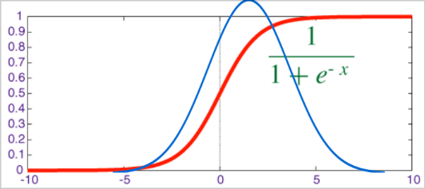
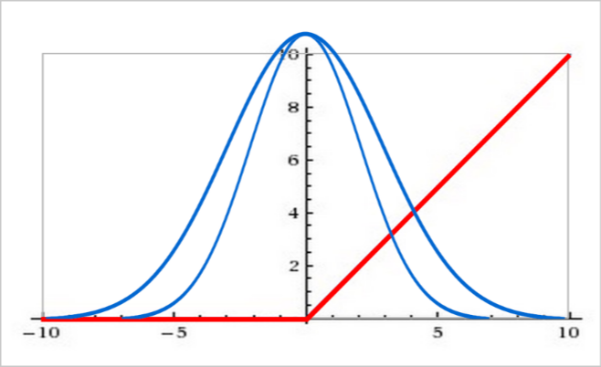

# Batch Normalization

Prima un ripasso dalla volta scorsa, con qualche dettaglio

## More on convolutional layer

Nella lezione precedente abbiamo parlato dei **convolutional layer** e dei filtri che si utilizzano. Il filtro in questione deve essere realizzato in base a quello che voglio ottenere. *Esempio:* se devo trovare gli **edge** (angoli) nella mia immagine, posso scegliere di applicare un filtro adeguato, diverso da quello che posso usare se voglio identificare i colori nell'immagine.  
*Nota:* il filtro viene scelto all'inizio e non viene modificato durante il training, quindi viene applicato sempre nello stesso modo su tutte le immagini.

Posso voler utilizzare due filtri diversi nella stessa neural network (*Es.* voglio usare un filtro per identificare gli edge verticali e uno per gli edge orizzontali). Usando n filtri io otterrò n output channels alla fine dell'applicazione. Avendo più di un output layer devo poi riuscire a combinare i diversi filtri in un singolo output.

Per fare questo di solito si utilizza la tecnica del **sampling**. Questa tecnica consiste nel prendere un'immagine e ridurla di dimensione. Questo mi permette di ridurre il numero di parametri che devo gestire e quindi di velocizzare il training. In pratica applico il filtro e per ogni passo prendo il numero massimo della matrice che ottengo applicando il filtro (*da vedere meglio*)

Come è stato detto nella scorsa lezione per poter applicare i filtri correttamente spesso sono costretto ad utilizzare un padding di modo che il mio filtro sia applicabile anche agli angoli correttamente. In particolar modo se utilizzo uno **stride** alto che permette di ridurre di più il numero delle feature (lo stride indica di quante posizioni muovo il filtro ad ogni passo).

Posso anche avere più **convolutional layer** ognuno dei quali può avere uno o più filtri. Questo vuol dire che ogni convolutional layer deve essere pensato per essere in grado di lavorare con il numero di channel che il precedente layer avrà in output. L'obiettivo finale è l'idea di riuscire a diminuire le feature prima di fare la **classification task** come visto nelle altre lezioni.

## Batch normalization

Slides di **Martin Görner**:<https://docs.google.com/presentation/d/e/2PACX-1vRouwj_3cYsmLrNNI3Uq5gv5-hYp_QFdeoan2GlxKgIZRSejozruAbVV0IMXBoPsINB7Jw92vJo2EAM/pub#slide=id.p>

### Data whitening

Quando si lavora con le immagini è molto importante fare il **data whitening**. Questa tecnica consiste nel normalizzare i dati in modo che abbiano una media 0 e una deviazione standard 1. Questo mi permette di velocizzare il training e di evitare che la rete si fermi in un minimo locale.

Il modo in cui si esegue di solito è sottraendo la media e dividendo per la deviazione standard. Il problema nel fare questo è che può succedere facilmente che i dati diventino un po' troppo strettamente collegati fra di loro, portando come conseguenza il fatto che un dato molto fuori dalla media porti tutti gli altri ad andare lontani dal loro valore originale.

Esistono diverse tecniche che permettono di evitare questo problema. Nel nostro caso non andremo nel dettaglio di quali sono però le librerie che useremo utilizzeranno delle tecniche avanzate di data whitening chiamando le funzioni corrette

In realtà l'operazione di data whitening viene di solito eseguita da un convolutional layer dato che è un'operazione che può essere eseguita utilizzando una moltiplicazione per una matrice e aggiungendo un bias, esattamente come succede con un filtro di un convolutional layer.

### Batch normalization basics

Il **batch normalization** è una tecnica che permette di evitare il problema di utilizzare direttamente la **sigmoid function**, ovvero che andando nei valori molto alti e molto bassi non riesco ad imparare bene dato che vengono appiattiti troppo (come si può vedere dal grafico della scorsa lezione).

Il modo in cui funziona è il seguente:

1. Si calcola la media e la deviazione standard di ogni batch (una batch è un insieme di immagini che vengono passate alla rete in un solo passaggio)
2. Si normalizzano i dati in modo che abbiano media 0 e deviazione standard 1 usando la funzione **logit**: $x_{new} = \frac{x - avg_batch(x)}{stdev_batch(x) + \epsilon}$
3. Si moltiplica il risultato per una matrice di pesi e si aggiunge un bias: $y = \alpha x_{new} + \beta$

Applicando questa normalizzazione posso utilizzare la **sigmoid function** senza problemi. Questo mi permette di avere una rete che impara molto meglio dato che la mia distribuzione è maggiormente nelle aree in cui la mia sigmoid function è in grado di funzionare meglio

>*Nota:* Se uso RELU non ho bisogno di alpha dato che la RELU taglia completamente i dati negativi, quindi non ha senso applicare questa tecnica dato che manterrei possibilmente i dati in una posizione che non è centrata rispetto alla funzione RELU stessa.
>

Per utilizzare la batch normalization ho bisogno dei valori della media e della deviazione standard di ogni batch. Questi valori vengono calcolati durante il training e vengono utilizzati per normalizzare i dati. **Questi valori vengono poi utilizzati anche in fase di test** per normalizzare i dati in modo che la rete possa fare una valutazione corretta.

*Nota:* Guardare il github di Martin Görner per vedere come funziona l'utilizzo delle neural network in TensorFlow: <https://github.com/GoogleCloudPlatform/tensorflow-without-a-phd/blob/master/tensorflow-mnist-tutorial/keras_04_mnist_convolutional.ipynb> **Aprire con Colab per poter anche eseguire il codice**
