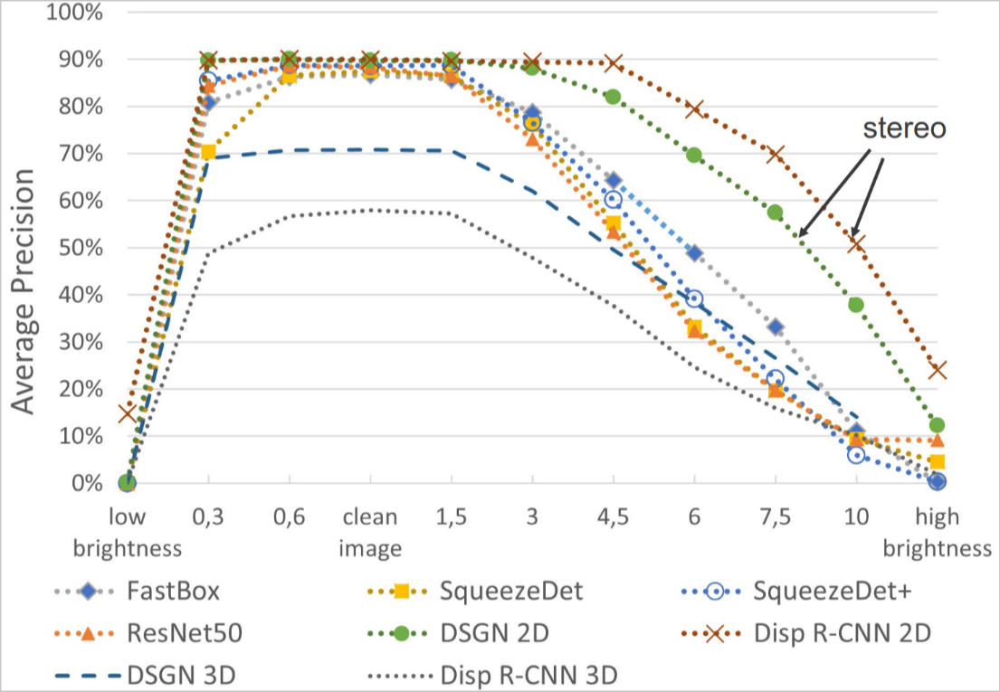

# RGB camera nella guida autonoma

*Nota:* da ritradurre :(

RGB cameras are one of the most used sensors for AI/ML applications. In this lecture we will try to understand what kind of failure can happen in relation to that.

There are many studies that talk about errors that might happen in relation to the accidental alteration of the output image of the camera. There is no systematic analysis on the possible malfunctions on an RGB camera and the resulting accidental modifications of images.

*Fine parte inglese* :(

## Architettura di una fotocamera

Analizzando lo schema di una fotocamera notiamo che abbiamo la parte della lente e all'interno un bayer filter, un sensore di immagine e un ISP.

Il filtro permette di ottenere le diverse componenti (R, G e B) dell'immagine, l'ISP è per processare le immagini, può permettere di eseguire correzioni o applicare specifici tipi di distorsioni all'immagine (*Es:* due telefoni con stesso sensore potrebbero permettere di ottenere due foto molto diverse fra loro in base al processore d'immagine che hanno).

Nel nostro caso considereremo una fotocamera frontale di una macchina. Applicheremo delle tecniche di FMEA (Failure Mode and Effect Analysis). There are many failure mode come: Banding, brightness, wind, water, spots etc. Dobbiamo riuscire a superare questi possibili failure andando a predire alcuni tipi di failure che potrebbero succedere.

*Nota:* in questo caso non parleremo dei rischi nella realtà dei failure, ma vedremo soltanto quali risks ci possono essere e perchè, oltre che come evitarli.

### Esempi di failure e loro mitigazione

- **Brightness:** una giornata può essere troppo luminosa o troppo buia per diversi motivi. questo tipo di failure può anche avvenire quando la luce cambia velocemente (*Es.* se si esce da una galleria). Di solito si corregge con il post-processing
- **Blurring:** può avvenire per diversi motivi, come ad esempio il movimento della fotocamera se la macchina prende un dosso o la strada è in generale dissestata. Si può correggere con l'uso di un filtro di sharpening.
- **Broken lens:** chiaramente la lente potrebbe rompersi del tutto, in qual caso sarà difficile riuscire a vedere in modo chiaro. È abbastanza facile identificare questo problema e notificare l'utilizzatore del problema, ma è difficile riuscire a correggerlo.
- **Broken VR:** in questo caso la componente che si rompe è quella che serve per andare a ridurre le conseguenze delle vibrazioni, il risultato è simile a quello del blur.
- **Dirty:** dei depositi potrebbero finire sulla camera. Se sono esterni è facile riconoscerli e dire all'utente di rimuoverli, mentre se sono interni è difficile aggirare il problema senza aprire la camera e pulirla da dentro
- **Flare:** i flare sono degli artefatti che possono essere visti nei video delle telecamere per degli specifici cambi di luce o situazioni. Migliorando il sensore si possono evitare e anche il post processing può aiutare.
- **Water:** se l'acqua entra nella camera si possono avere dei problemi di visione. In questo caso si può cercare di proteggere la camera con delle protezioni apposite.
- **Condensation:** se la camera passa da un ambiente freddo ad uno caldo si può avere della condensa. In questo caso si può cercare di proteggere la camera con delle protezioni apposite, il risultato della condensa è alla fine molto simile a quello della water.
- **Heat:** il caldo potrebbe danneggiare delle parti che si muovono, come lo zoom. Il miglior modo per "risolvere" questo problema è evitarlo a priori
- **Ice:** la neve potrebbe impedire la visione e anche danneggiare le componenti interne se riesce a penetrare. Anche questa va prevenuta principalmente
- **Water, wind, brakish, electrical overload:** come quello sopra, creano problemi e vanno principalmente evitati usando una protezioni per la telecamera.

### Failure relativi all'ISP

- **Banding:** bande verticali e/o orizzontali che possono apparire in alcune situazioni. Si possono correggere con il post processing
- **Dead pixels:** pixel che non funzionano più. Si possono correggere con il post processing

*Note:* ce ne sono altri esempi sulle slide, Pier quando guardi qui scrivi tutto :)

## Case study: car detector nel KITTI vision benchmark

Consideriamo le immagini dalla KITTI vision benchmark. Lo dividiamo in training e validation. Useremo come metrica la precision AP.

### Car detectors

Consideriamo 6 diversi tipi di detector:

**Mono camera:**

- **FastBox**
- **SqueezeDet**
- **SqueezeDet+**
- **ResNet-50**

**Stereo camera:**

- **DSGN**
- **Disp R-CNN**

I parametri per scegliere proprio questi sono stati principalmente:

- il fatto che siano prodotti dopo il 2016
- che siano open source (o comunque che il loro codice sia disponibile)
- che producano delle scatole di bounding nel formato KITTI (sono le scatole verdi che si vedono nelle immagini di riconoscimento)
- che siano tutte RGB

Sul validation set sono state applicate 130 **failure configuration** che riprendano i failure mode che sono stati presentati sopra.

### Average precision

La **average precision** AP schematizza la forma della curva precision/recall ed è definita come la precisione media in un set di n intervalli equispaziati di livelli di recall. Abbiamo preso il valore n=40 su KITTI, ovvero:
$$AP = \frac{1}{40}\cdot\sum_{r\in\{0, \frac{1}{40}, \frac{2}{40}, \dots, 1\}}{p_{interp}(r)}$$
In cui la precisione p ad ogni intervallo è interpolata prendendo la massima precisione misurata per la quale il valore di recall supera r.

### Risultati

Possiamo notare che la luce in effetti gioca un ruolo abbastanza importante, così come la lente rotta o sporca:

Altre failure mode invece non hanno causato niente di rilevante come banding or dead pixel.

## Self driving agent

Injectiamo dei failure nel trained agent Learning by cheating for the **Carla** simulator.

In ogni passo della simulazione abbiamo:

1. un'immagine RGB che è acquisita dalla camera frontale della macchina e la velocità ottenuta da un sensore di velocità
2. dei waypoint sono inseriti nell'immagine a formare una traiettoria
3. le informazioni sopra sono usate per predire la sterzata, il trottle e la frenata
4. a quel punto queste 3 informazioni vengono effettivamente usate sulla macchina.

In questo caso diamo al modello l'informazione che il test ha successo se la macchina raggiunge il punto di arrivo entro il tempo limite impostato. Dopodichè abbiamo identificato 17 configurazioni di failure e le abbiamo iniettate 150 volte ciascuna.

Vediamo che i risultati sono molto brutti in alcuni casi, come ad esempio in dead pixel, banding o dirty lens, con un'accuracy che è intorno al 50% (in alcuni casi sarebbe più conveniente tirare ad indovinare)

Vogliamo creare un modello che sia più robusto (ovvero che quando ci sono delle immagini corrotte è in grado di identificarle meglio).

Quando consideriamo un modo per migliorare il nostro agent per renderlo più robusto consideriamo un modello che non va a fare una notifica delle immagini corrotte ma che semplicemente restituisce un risultato sempre. In questo modo si può avere un certo livello ti tolleranza ai failure.

## Sliding window e single frame TSR

Check the slides: <https://e-l.unifi.it/pluginfile.php/2800322/mod_resource/content/3/Lecture3b-camera%20failure.pdf> they are clear

*Esempio su phi e w* uno studente fa una domanda al professore, e lui dice "un altro studente può risolverlo" e lo fa risolvere a lui. Anche se il prof. Lo sa risolvere delega il lavoro ad un altro studente.

Basato su questo si può andare ad identificare se un componente è in grado di definire se un altro componente è in grado di identificare correttamente un'anomaly oppure no. In base a questo questo secondo componente potrà decidere se una task è da inviare a lui oppure no.

