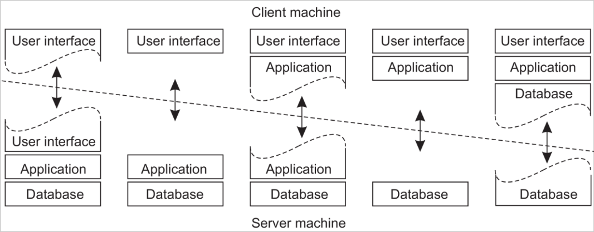

# System architectures

There are two main strategies to deploy components on node **Vertical** and **Horizonal** distribution.

## Centralized architecture

### Client-Server

This kind of architecture is usually realized through the use of a Client-Server architecture. There are components that offer services (**servers**) and components using services (**clients**).

When a request is sent to a server, it's a single message in the application level, but it usually leads to the use of multiple message in the network level. In real life sometime the server is hidden behind layers to the client (*I.e:* the clients doesn't usually make requests for a database directly but it can still contact it through the use of an application layer).

### Example: NFS

#### File system

The structure of the file system is:

- **logical file system**: it provides the API to the layer below
- **virtual file system:** provides an abstraction that allows the use of multiple physical file system
- **physical file system:** provides the physical operation interacting with the storage device.

The **Access model** in this case works like this:

- clients can access files through the use of the **virtual file system**
- the operation that are available to the clients are implemented in the server side
- every operation requires a communication with the server.

### Upload/Download model

This approach is an alternative to the client/server model. In this case the client can download a file locally and then access it. When it is done it uploads the file back to the server. *I.e:* Dropbox.

*Note:* In this case the client doesn't need to send the file back to the server, this is done automatically once it's done. That is also why Git isn't a direct implementation of this model, cause you need to explicitly push and pull of files.

#### Pros and cons

- **Consistency:** in the C/S approach the consistency is guaranteed. In the U/D model the consistency is not guaranteed. *I.e:* what happens if two people work on the same file and then both try to upload the changes?
- **Latency:** in the C/S approach the latency is higher, since every operation requires a communication with the server. In the U/D model the latency is lower, since the client can work locally.

#### Example web server

In this case the client can download the web page and then access it locally. Once the page is loaded it's usually static (for the most part) and the client doesn't need to access the server any longer. If the clients interacts with the page he may generated new requests that the server will need to handle.

### Layers in the application

We usually consider these kind of organizations in layers:

- **Single tier:** all the components are on the same machine (typically used many years go, using a single main frame)
- **Two tier:** the first layer is on the client, the others are on the server
- **Three tier:** the first layer is on the client, the second is on the server, the third is on another machine

*Note:* we can also have other organizations that are based on these ones, for instance if we consider a two tier architecture we can have:

## Peer-to-Peer architecture

In this kind of architecture there is no distinction between clients and servers. Every node can act as a client and as a server. Who is a client and who is a server is determined only by the way it's acting in a specific period of time.

The peer-to-peer architecture can be structured or unstructured. In the structured way we usually have some kind of **special peer** that have some kind of special role. In the unstructured way we don't have any kind of special peer.

There is usually an overlay network that defines how the peer can communicate and join the net.

### Communications in a P2P network (ToDo alone from slides)
