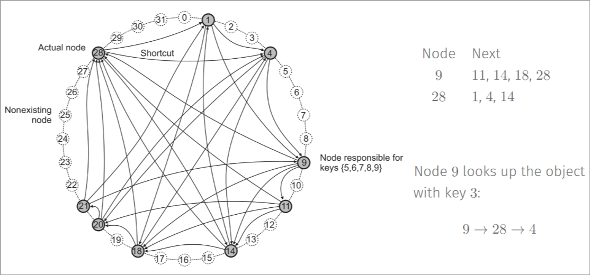

# System architectures

There are two main strategies to deploy components on node **Vertical** and **Horizontal** distribution.

## Centralized architecture

### Client-Server

This kind of architecture is usually realized through the use of a Client-Server architecture. There are components that offer services (**servers**) and components using services (**clients**).

When a request is sent to a server, it's a single message in the application level, but it usually leads to the use of multiple message in the network level. In real life sometime the server is hidden behind layers to the client (*I.e:* the clients doesn't usually make requests for a database directly but it can still contact it through the use of an application layer).

### Example: NFS

#### File system

The structure of the file system is:

- **logical file system**: it provides the API to the layer below
- **virtual file system:** provides an abstraction that allows the use of multiple physical file system
- **physical file system:** provides the physical operation interacting with the storage device.

The **Access model** in this case works like this:

- clients can access files through the use of the **virtual file system**
- the operation that are available to the clients are implemented in the server side
- every operation requires a communication with the server.

### Upload/Download model

This approach is an alternative to the client/server model. In this case the client can download a file locally and then access it. When it is done it uploads the file back to the server. *I.e:* Dropbox.

*Note:* In this case the client doesn't need to send the file back to the server, this is done automatically once it's done. That is also why Git isn't a direct implementation of this model, cause you need to explicitly push and pull of files.

#### Pros and cons

- **Consistency:** in the C/S approach the consistency is guaranteed. In the U/D model the consistency is not guaranteed. *I.e:* what happens if two people work on the same file and then both try to upload the changes?
- **Latency:** in the C/S approach the latency is higher, since every operation requires a communication with the server. In the U/D model the latency is lower, since the client can work locally.

#### Example web server

In this case the client can download the web page and then access it locally. Once the page is loaded it's usually static (for the most part) and the client doesn't need to access the server any longer. If the clients interacts with the page he may generated new requests that the server will need to handle.

### Layers in the application

We usually consider these kind of organizations in layers:

- **Single tier:** all the components are on the same machine (typically used many years go, using a single main frame)
- **Two tier:** the first layer is on the client, the others are on the server
- **Three tier:** the first layer is on the client, the second is on the server, the third is on another machine

*Note:* we can also have other organizations that are based on these ones, for instance if we consider a two tier architecture we can have:

## Peer-to-Peer architecture

In this kind of architecture there is no distinction between clients and servers. Every node can act as a client and as a server. Who is a client and who is a server is determined only by the way it's acting in a specific period of time.

The peer-to-peer architecture can be **structured** or **unstructured**. In the structured way we usually have some kind of **special peer** that have some kind of special role. In the unstructured way we don't have any kind of special peer.

There is usually an overlay network that defines how the peer can communicate and join the net.

### Unstructured P2P

In this case the peers are connected in a random way. The peers can join and leave the network at any time. The peers can also communicate with each other in a random way. When a peer joins the network he usually needs to know at least 1 peer from which he can obtain a list of other existing peers.

#### Flooding

To obtain a **resource** we use the idea of **flooding**. A peer passes that receives a query can discard it if it has already received it, otherwise it can handle the request if he can, and otherwise he can keep on flooding to it's neighbors. These kind of requests usually contain a **TTL** (time to live) that indicates a number of hops after which the packet is removed from the net.

#### Random walk

This approach is a variation of the flooding one. In this case the peer that receives a request can decide to forward it to a random neighbor. This approach is usually more efficient than the flooding one. The main issue is that we cannot make assumptions that allow us to guarantee that a node receives a message at which he should respond. This may happen if randomly the packet doesn't reach the "correct" neighbor. (*Note:* looking at the book we can see a proof of why actually on average this approach is equivalent to the flooding one, **with a much lower number of packets exchanged**)

### Structured P2P

In this network we have a specific topology like: a ring, a tree, a mesh, etc.
We have a **DHT** (Distributed Hash Table) that is used to store the information about the peers. Each resource is associated with a key, so the system stores (key,value) pairs.

Each key can be returned through the use of a hash function and each peer has the key assigned using the same function.

The **lookup function** is used to find the peer that has the key associated with a specific resource. The lookup function is usually implemented using a **recursive algorithm**.

#### Example: Chord

Rules of the Chord network:

- Nodes and objects are assigned 𝑚-bit identifiers that are computed using a consistent hashing function as SHA-1.  
*Note:* A consistent hashing function ensures that when a hash table is resized, only 𝐾/𝑛 keys needs to be remapped on average, where 𝐾 is the number of keys, and 𝑛 is the number of slots
- The space of keys is organized in a ring with at most 2𝑚 elements.  
- An object with key 𝑘 is assigned to the node with the smallest identifier 𝑖𝑑 ≥ 𝑘 (call it
the successor succ(𝑘))
- Each node 𝑛 contains a routing table (called finger table) with 𝑚 elements: the 𝑖th
entry of node 𝑛 will contain succ((𝑛 + 2𝑖−1)𝑚𝑜𝑑 2𝑚)
- Looking up an object with key 𝑘 reduces to deliver the request to its successor: a node
passes the query to the closest successor of 𝑘 in its finger table, i.e., the “largest” one on the circle whose ID is smaller than 𝑘

*Note:* the main issue about this idea is that it might be hard to implement in real life.

## Hierarchical architecture

Peers are classified into two groups: **super-peers** and **week peers**. The super-peers are responsible for the management of the network and the week peers are responsible for the data exchange.

*Example:* Skype in the first versions used this kind of architecture.

Every weak peer must be connected to a super-peer. All the communication between two peers relies over a super-peer.

## Hybrid architectures

In this case we have a mix of the previous architectures. *I.e:* we can have a P2P network that uses a server to store the data.

In real life this is the most common kind of architecture. Some examples are the **cloud computing**, **edge computing** and **block-chain system**

## Cloud computing

**Definition (NIST):** Cloud computing is a model for enabling ubiquitous, convenient, on-demand network access to a shared pool of configurable computing resources (e.g., networks, servers, storage, applications, and services) that can be rapidly provisioned and released with minimal management effort or service provider interaction.

*Note:* this definition is not really useful to read on its own, we need to understand what the different parts that compose it mean. This definition is based on a pay-per-use cloud idea and a system that uses virtual machines.

### Organization in cloud computing

- **Hardware:** provides tools to manage the hardware underneath
- **Infrastructure:** provides tools to manage the virtual machines
- **Platform:** provides tools to manage the applications
- **Software:** provides tools to manage the application that already exist in the cloud

The main characteristics of the cloud are:

- **On-demand self-service:** the user can provision the resources without the need of human interaction with the service providers. *I.e:* I open AWS and I am able to pick what I want to use on my own.
- **Broad network access:** the resources are available over the network
- **Resource pooling:** the resources are shared among multiple users. The user can sometimes pick resources located in specific areas (*I.e:* I have a client in Asia I look for my resources to be in Asia).
- **Rapid elasticity:** the resources can be scaled up or down quickly based on the user's demand.
- **Measured service:** the resources are monitored and the user is billed based on the usage. This also means that you can have access to reports on how you are using the resources you are paying for

### Service models

- **IaaS (Infrastructure as a Service):** the user can rent virtual machines and storage. The user is responsible for the management of the virtual machines and the storage. *I.e:* AWS, Azure, Google Cloud
- **PaaS (Platform as a Service):** the user can rent a platform to develop applications. The user is responsible for the development of the application. In this case the user cannot configure the machine. *I.e:* Google App Engine, Heroku
- **SaaS (Software as a Service):** the user can rent a software. The user is responsible for the use of the software. The user might be allowed to make some modification to the app. *I.e:* Google Docs, Office 365.

*Note:* there are two kind of clouds usually, the **public cloud** and the **private cloud**. The public cloud is a cloud that is available to everyone, the private cloud is a cloud that is available only to a specific organization. There can be **hybrid cloud** which means that we have a cloud that is public and interacts with a private part (or viceversa).

## Edge computing

**Definition:** Edge computing is a distributed computing paradigm that brings computation and data storage closer to the location where it is needed, to improve response times and save bandwidth.

### Edge vs Cloud

- **Latency and bandwidth:** the edge computing is usually faster than the cloud computing. The edge computing is usually used when the latency is a critical factor.
- **Privacy and security:** the edge computing is usually more secure than the cloud computing. Sometimes company have specific security policies that doesn't allow to process the data on the cloud.
- **Availability:** the edge computing is usually more available than the cloud computing. This is because nodes can work on their own while being offline and go online only to sync the changes.

#### Deployment and orchestration

The deployment of the edge computing is usually more complex than the cloud computing. The edge computing usually requires the use of **orchestration** to manage the resources. This is because of:

- **limitation of resources:** many edge nodes may have limited resources
- **heterogeneity:** the edge nodes may have different hardware and software
- **dynamic workloads:** the edge nodes may have different workloads

### Fog computing

**Definition:** Fog computing is a distributed computing infrastructure in which some application services are handled at the network edge in the place where data is generated.

*Note:* Prof. Thinks that there is no actual different between fog and edge computing. It's just two names for the same thing for marketing purposes.

The **fog** nodes are the nodes that are in the middle between the edge and the cloud. The **fog** nodes are usually used to preprocess the data before sending it to the cloud, but this can also be achieved using the edge nodes.
