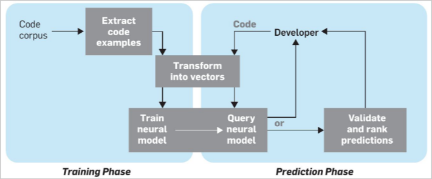

# Software analysis

## Project idea

The project we need to provide is a fully working example of code auto-completion. It doesn't need to be the latest implementation available in the literature but it should be supported by our choices.

The main 4 information needed are:

- **Dataset**
- **Tokenizers**
- **Embeddings**
- **Architectures**

The exam will be composed of a code presentation and description of the project. Can be cone in 2-3 people groups (but also alone). We will need to use **pytorch** and scikit-learn (if needed)

### Software analysis

We will see mainly software analysis done on **source code** (but it can be done also on executables and documentation). The basic idea is to improve **performance**, **security** and also **readability**

#### Static vs Dynamic analysis

- **Static**: Analysis done on the source code without executing it (dataflow analysis, syntax checking, linters and reverse engineering)
- **Dynamic**: Analysis done on the source code executing it (profiling, debugging, testing and fuzzing)

*Note:* static is usually easier to perform but there are specific cases where dynamic is needed.

### Abstract syntax tree

The AST is a tree representation of the abstract syntactic structure of source code written in a programming language. Each node of the tree denotes a construct occurring in the source code. The syntax is abstract in not representing every detail appearing in the real syntax.

AST are used for static analysis but also for code generation and transformation. They are used in machine learning and data mining for code analysis.

There are many tools to extract AST from source code, like **ast** in python (check some exampled for other languages).

### Control flow graph

A control flow graph is a representation of all paths that might be traversed through a program during its execution. It is used in compilers, static analysis and also in reverse engineering.

There is usually represented also code which is not called (like dead code) that can be relevant or hiding information. The different parts of the code are represented through the use of **nodes** and **arcs**.

### Model checking

This part is done through formal verification. So we build a model of how the project should work and then check if the code actually resembles it and has all the characteristics needed.

### Fuzz testing

Fuzz testing is a software testing technique that involves providing invalid, unexpected, or random data as inputs to a computer program. The program is then monitored for exceptions such as crashes, failing built-in code assertions, or potential memory leaks.

*Note:* we introduce software analysis in order to handle the complexity of such methods. More details about that on the slides.

## Papers

### Neural software analysis

#### When are ML useful?

- **Dimenstion 1:** if the code has property A then B holds, or if the code is like pattern A then B is likely to hold
- **Dimension 2:** neural software analysis often outperforms traditional methods in terms of accuracy
- **Dimension 3:** neural models are data-hungry so they work better if there are plenty of examples to learn from

To extract the code we start with a **lightweight static analysis** for the **tokenization** and **parsing** part. This is because this part is more easily scalable and portable.

We also need to obtain **labeled examples** since neural software analysis uses primarily supervised learning. (*Note:* for our project we will want to start with labeled dataset, which makes it easier to understand)

#### Representing the code

The code can be represented using **vectors** and then using those vectors as tokens representing code. *Check the slides for more insight* on this, but also check the jupyter notebook on how to do this on python in more details.

The natural models usually consist of two parts:

- **summarizing and encoding** (writing comments based on the code, or writing code based on comments)
- **prediction** (helping you write the code)

*Note:* more details on the slides

Other than those steps we can always do some **training** and **ranking** over the different predictions.
