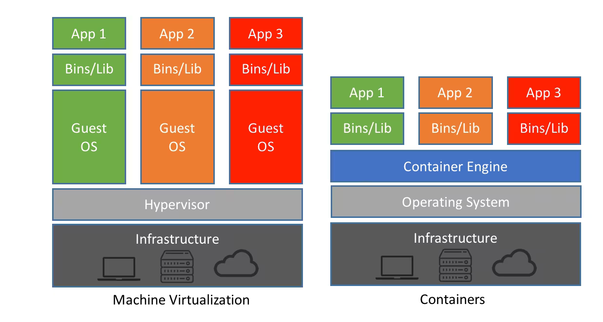

# The laboratory

We will use a laboratory with vulnerable targets in the next lectures, for now we are just going to see how it can be created and then we will start actually attacking it in a few lectures.

## Virtualization

This concept if fundamental for the creation of our laboratory. What we mean in this case is running software inside another piece of software. Basically it's what we will do in order to use switches and routers inside GNS3.

What you need:

- a software called hypervisor
- the iso images of the software you want to run
- access to the software
- start the virtual machine

*Note:* you should also follow the steps in order to install the operating systems inside the single virtual machines (**Virtualbox** is an example of hypervisor which is free and open source).

### Hypervisor and linux containers

The kind of hypervisor that we will use will be **QEMU** and **Virtualbox** as well as some docker containers.

*Note:* docker containers are effectively linux containers.

### Suggested isos

The suggested ISOs that are suggested to install for the course are:

- kali linux
- windows 7
- windows 10

*Note:* Kali linux is just a container of many of the tools that we will use in the course, but **it's not suggested** as we will see the single tools on the way and we don't need to have all of them (and probably even some useless ones) installed from the very start.  
*Note:* also in real life, penetration testers usually only install what they need in that particular moment and avoid having useless tools installed.

### Network management

It should be noted that we can also do network management inside the hypervisor. In case of **Virtualbox** we can go inside the settings and then change the network part of the virtualisation, which means basically telling the virtual machine what kind of "fake" network card(s) it should use.

#### Types of network

There are 6 main kind of networks that we can use:

1. *Not connected*: the virtual machine is not connected to the internet
2. *NAT*: the virtual machine is connected to the internet but there is no guest-host and guest-guest communication
3. **Nat-network**: the virtual machine is connected to the internet and there guest-guest communication
4. *Bridged*: the virtual machine is connected to the internet and it has its own IP address. There's also guest-host communication (much like if the virtual machine was a real machine attached to the host).
5. *Internal network*: a virtual switch is in the net. This means that there is no connection with the outside, unless one of the switches actually connects to the outside.
6. **Host-only network**: the virtual machine is connected to the host and can communicate with it.

||VM $\rightarrow$ VM|VM $\rightarrow$ Host|VM $\rightarrow$ Internet|
|---|---|---|---|
|Not attached|No|No|No|
|NAT|No|No|Yes|
|NAT-network|Yes|No|Yes|
|Bridged|Yes|Yes|Yes|
|Internal network|Yes|No|No|
|Host-only network|Yes|Yes|No|

### GNS3 and VMs

In GNS3 it's possible to use many different kinds of VMs, amongst them we find Virtualbox, QEMU but most importantly also docker containers.

*Note:* It should be noted that in some cases we **cannot use docker containers**. During the course we will see some instances in which we won't be able to use them and we will have to rely on some more complex kind of virtualisation.

#### Virtual machines vs docker containers

If we look at the stack of the virtualisation we can see that the virtual machines usually have many more layers than the containers:

### Topology of the laboratory

**Check the slides** for the actual topology + the file will be shared on moodle later.

The attacking machine should be connected to the outside network. This gives us two possibilities:

- Create an external client
- Use our own host machine

The second option is the suggested one, but the first one is also possible, in particular is some tools that we will see doesn't work on the OS that you usually use you can always use a docker container with the right OS and use the CLI.

### Information gathering

Ofc in this case we must decide what kind of activity we want to perform on our laboratory.

In particular we can have 3 kinds:

- **White box**: we know everything about the system
- **Black box**: we know nothing about the system
- **Gray box**: we know something about the system

In the case of the laboratory we most likely have a white box system if we consider that we are building it ourselves. Even knowing that usually in the company the most common kind of testing that you are asked to perform is the gray box one, so we will move towards that. This means that we won't take all the information that we actually have as known, just for learning purpose.

*Note:* Most of the times the real attackers work on black box mode while the penetration testers work in gray box mode. Usually **overestimating** the capabilities of the attacker is the safest route.

#### OSINT

OSINT is part of the information gathering, is a very important part and is usually done as a preliminary task.

The acronym stands for **Open Source Intelligence** and it's the process of collecting information from publicly available sources.

*Example:* you need to do pentesting for a transport company, the first thing that you will want to do is start collecting information on their employees, suppliers, business relationships, etc.  
What might happen is that when a ransomware group attacks a big company, they might actually attack one of the smaller companies in the chain that is probably easier to attack.

*Note:* in Italy even if an information is public, you cannot actually use it if it was obtained in a way that is not legal. *Example:* information about a database are published on the deepweb publicly, you are not allowed to read them, that is not the case in the US.

### Tools for information gathering

There are many tools that can be used for information gathering, some of them are:

- **Google dorks**: using google to find information. This might seem like a very simple tool, but it's actually very powerful. You can query very complex data and also filter the list that you get with many different options. The actual language used is evolving over time, so you should always look at the official google page to check the syntax.
- **Google queries**: you can use google to find information about a specific website. *Example:* `site:unibo.it` will give you all the pages that are in the unibo domain. Other practical examples: `filetype:pdf`, `intitle:`, `inurl:`, etc.
- **Google cache**: **(no longer working for the most part)** you can use the cache to see the old version of a website. This is useful if you want to see the old version of a website that has been updated.
- **Internet archive**: you can use this tool to see the old version of a website. The old version might contain information that are no longer available and also information that shouldn't have been public in the first place.
- **Open job postings**: you can use this tool to see what kind of technologies are used in a company. This is useful because usually the job postings are made by the HR and they don't know what kind of information they should not disclose.
- **Metadata extraction**: the metadata of a file contains the information on the files itself. The amount of information contained in the metadata can be very big, in particular because people don't realize how much information might be contained in the metadata of their files.  
*Example:* you can use the `exiftool` to extract the metadata of a picture and see where it was taken, when it was taken, etc.
- **DNS**: you can use the DNS to find information about a website. *Example:* you can use the `dig` command to find the IP address of a website.
- **Shodan**: this is a search engine for the internet of things. It's a very powerful tool that can be used to find information about the devices that are connected to the internet.

*Note:* check more names on the slides, but they are changing over the years, so you should always look for the most updated ones.  
*Note:* nowadays we can also find some kind of **chatGPT dorks** that are used to get useful information from LLMs.
*Note:* in general this very first part sometimes require very little time and little technical knowledge but might allow for a very much easier second part moving on.
