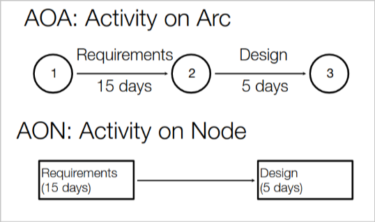
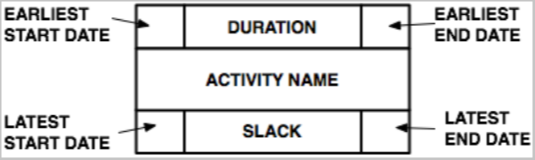

# Project sceduling

## Overview

In this case we usually start with:

- A **WBS** (Work Breakdown Structure) that breaks down the project into smaller tasks.
- An **effort** (duration) estimation for each element

*Note:* the activities must be scheduled so that we know when they start and end.

The main goal is to create a **Gantt chart**. The basic idea is to start from **constraints**, find the **critical path** and iterate over it until it's satisfactory.

*Note:* there are many software that can generate Gantt charts nowadays, each one has pros and cons

## Identifying the constraints

**Constraints** in this case can also be defined as **dependencies**. There are 2 main types of dependencies:

- **Hard dependencies**
- **Soft dependencies**

### Hard dependencies

These are the dependencies that you cannot avoid addressing and having. They are derived from the project **logic** and from **external dependencies** that we have no control on.

Actually they can be eliminated but it usually requires a high cost, either in terms of risks or resources needed to re-elaborate the project. *Note:* this usually means that they are usually kept as they are and removed only if it cannot be avoided.

### Soft dependencies

These dependencies are usually a choice among many alternative plans. They are usually derived from **discretionary choices** or from the resource availability and leveling.

*Note:* soft dependencies are easy to make and change at first, but as the project goes on they become harder and harder to manage.

## Task dependency relationship

There are 4 main types of dependencies:

- **Finish to start (FS)**
- **Start to start (SS)**
- **Finish to finish (FF)**
- **Start to finish (SF)**

They all indicate how the tasks are related to each other. (*I.e:* finish to finish means that they should finish at the same time)

### Lead and lag time

Given what we stated above, we can also have **lead** and **lag** time. These are used to indicate how much threshold we have in the dependency relationship.

### Rules of thumb

- It's not only important to add tasks and dependencies, it's also important to add **milestones**. These are used to indicate the end of a phase or a part of the project
- the **dependencies** might seem fancy to have and use, but actually if there is no need for them, it's better to avoid them
- a very common dependency is the one on the **date** of the calendar
- all the possible alternatives should be evaluated and all the dimensions should be taken into account when evaluating them.

## Critical path method

The basic idea of this method is that not all the activities in a project are equally important or **critical**. The critical activities are the ones that if delayed, will delay the whole project.

### Network diagrams

This is a way to represent the project in a graphical way. It's usually represented as a **graph** where the nodes are the activities and the edges are the dependencies. It was first developed in 1950 and there are two classic formats of it:

- **Activity on node (AON)**
- **Activity on arrow (AOA)** (also called **Activity on arc**)

It's hard to determine which one is better. It depends on the specific use case. For our project the professor suggests **activity on node** (which is usually better for software projects).

*Note:* one of the reason why AON could be preferred is that sometimes in AOA it might be needed to include dummy arcs and nodes to express some dependencies.

### Critical path computation

- **Free slack** is the amount of time that a task can be delayed without delaying the next task
- **Total slack** is the amount of time that a task can be delayed without delaying the project end date
- **Slack time** SL=TL-TE (where TL is the latest time and TE is the earliest time)

In order to compute the **slack time** we consider an AON notation as follows:

#### Some definitions

- **forward pass** is the process of computing the earliest start and finish times for each activity
- **backward pass** is the process of computing the latest start and finish times for each activity
- the difference between the **forward pass** and the **backward pass** is the **slack time** of an activity
- the critical path is the path in which all the activities have a slack time of 0
- every plan has a critical path

