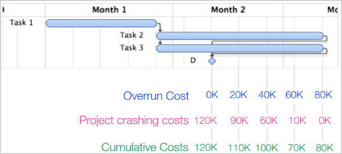

# Resource allocation and Resource leveling

## Simplified process

**Inputs:** the plan, the project team, the delivery dates

**Resource allocation:** the process of assigning the resources to the tasks

**Constraints:** according to availability and needs (being careful not to over-allocate the resources)

*Note:* if there is no solution that satisfies all the constraints we need to vary some hypothesis like increasing the team size or relaxing some constraints.

*Note:* we can try to use some optimization algorithms to find the best solution if just trying this naif approach doesn't produce the expected results. We will see them in the next lecture

## Resource usage

In this case the resource usages can be analyzed based on 3 aspects:

- **manpower**: the amount of work that can be done by a person in a certain amount of time
- **equipment**:  number of items necessary in a certain amount of time
- **materials**: the amount of materials necessary (usually consumed) in a certain amount of time

**Overallocation:** a situation where a resource is used more than its maximum capacity

## Optimization

### Making plan feasible

You can change some of the hypotheses on which your plan is based on, like:

- reducing the scope
- reducing the quantity
- outsource some activities

Otherwise you can change some logic on the plan:

- increase resources (**project crashing**)
- evaluate alternatives
- change the rules: eliminate some hard constraints (it might increase risks, **fast tracking**)
- work on probability of delivering on time (**critical chain management**)

### Project crashing

Usually the project can easily be reduced in its duration by simply assigning more labor to project activities (assigning over-time or using more resources).

The main issue is that those measures also increase the cost of the project, so an analysis of the **trade-off** between cost and time should be done.

The project crashing method simply consists in reducing the duration of one or more activities. The objective is reducing the time while avoiding increasing the cost by much.

Example:

We can see that reducing one week is always better than not reducing the time, so this is a no brainer to reduce the time of at least one week.

Given that, sometimes we will still need to reduce the time by more than only a week, for instance if our client wants the project on time and cannot afford to have 4 weeks delay, we might decide to just do the maximum crash possible and keep the client happy so that we can gain more in the future.

*Note:* a simple way to perform crashing is just to ask the employees to work more, but this might have negative consequences making them less happy and productive.

### Fast tracking

The fast tracking idea is that the deliverables are incrementally produced (**and refined**) during the execution of the activity. This means that a deliverable could be used before the last day even if it's not entirely refined.

The basic Idea is to make activities overlap even if they would normally be sequential. This can be done because the activity that comes after is going to use some kind of "prototype" deliverable of the one that comes before.

Fast tracking is considered **risky** and might cause the need to apply rework of the project. It should be evaluated really carefully which dependencies can be broken and which cannot. Also we should be careful to understand when a deliverable is usable even if not refined. (*I.e:* I'm finishing developing the APIs of my framework, I can tell the developers of another part to just use the ones that are ready and assure them they won't be changed, they should not use the APIs that I know I'm going to break really soon).

### Critical chain management

In this approach we consider that all the estimation are average guesses. Saying that an activity lasts X, means that **most of the times** it will take X to complete. There might be cases in which it takes less or more to complete.

To manage the contingencies, project managers will move the estimations to the **pessimistic** side. Given that, only a few buffer are needed usually.

This method is interesting because it uses the most probable estimates (even if on the pessimistic side of them). We will try to always have estimation with high probability when we are considering them. More than that we will consider a **standard deviation of the chain of activities** which is usually less than the sum of the standard deviation of the single activities.

So in this idea we always **monitor chains** and we make the **contingency buffer explicit**. The manager will always manage chains and during the execution of the plan we will have some activities that last longer than planned but it's fine. Some activities might make the chain overflow the contingency buffer but that is also fine to an extent.

A **buffer definition** should be considered and then a **buffer management** can be performed in order to evaluate if the delay we are having is fine or we start to need worrying.
