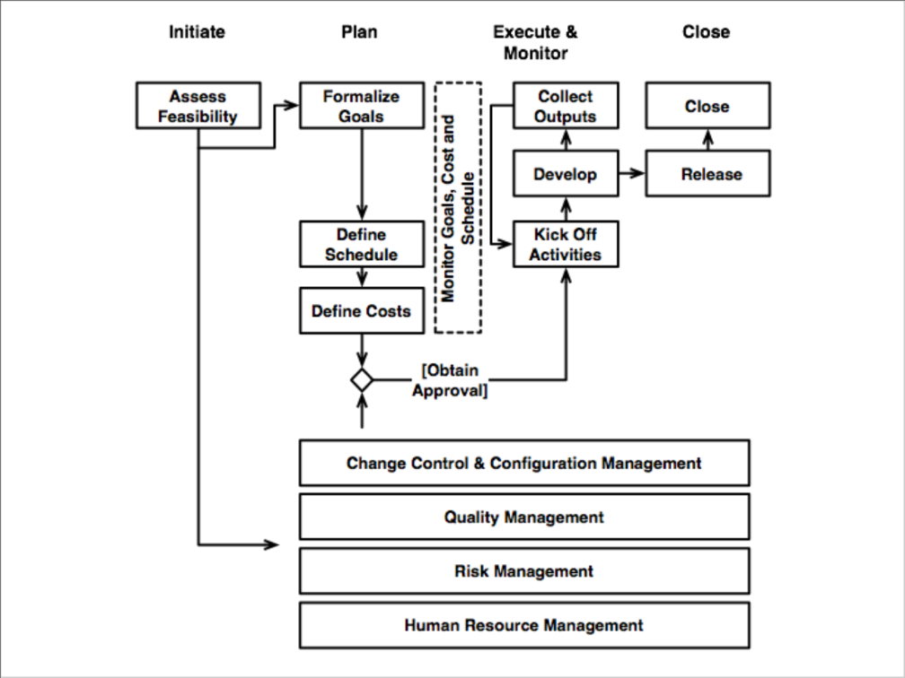
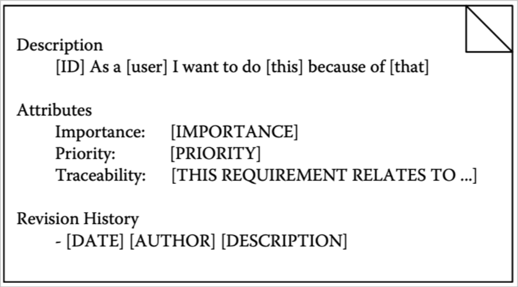

# Organizing the development of Software projects

*Note:* next lecture we will discuss about our idea for the project.

Software project management is the integration of management techniques to software development. This became necessary when the software projects became so big that they needed some kind of management. Previously software projects were done by a single person.

This need started in 1960 during the so called "software crisis". The software crisis was a term used in the early days of computing science to describe the impact of rapid increases in computer power and the complexity of the problems that could be tackled.

Everytime we think of creating a project there are specific questions that we need to answer. Some of them are pretty straightforward some other are harder to answer.

The phases of a project depend on the project we are developing. There is also a dependency on the stakeholders that we are relying on to get money. *I.e:* a private could be willing to check you only at specific periods of time that you can decide with him, a public entity could decide when you need to get the job done on its own.

## Framework

Usually a software development project relies on a specific framework that looks like this:

## Small intro to software development

*Note:* this is only an introduction to software development to give a few names and concepts that will be necessary for the next lectures.

There are multiple approcches that can be followed when developing software. For instance today an approach widely used is the Agile approach. There are a few problem with this approach such the ones concerning security or speed. Many people love agile.

**Phases of the software development:**
- requirements and User experience design: this part is fundamental nowadays cause the users have many choices and they must have a reason to like your app better than the others.
- design (software wise)
- implementation
- verification and validation
- deploy
- operation and maintenance

**Requirements:**
in this lecture we are talking about requirements tied to the software. We are going to talk about the requirements of the project in the next few lectures. Here we are talking about technical requirements related to the software.  
The **goal** of this part is to form a shared view about the characteristics that the system must have.
The **output** of this part is usually some sort of document that describes the requirements of the system.  
**Textual requirements:** using text to describe the requirements has pros and cons. The pros are mainly relate to how easy they are to write and distribute and also they usually are really easy to understand for the developers. The main cons are regarding the client not being really able to understand them. *Note:* there are templates to formulate textual requirements, usually there are two types of documents, one can be compiled by any user while the other can be compiled only by **superusers** (administrators).  
*Example of template:*

There are many kind of diagrams that can describe the functions that an application should provide but they can be hard to understand for the client even more. Also diagrams are good to express **functional requirements** but they usually cannot express non functional requirements at all

**Requirements engineering:**
the **goal** is to define and maintain requirements. This is a specific job that must be done during the development of the project. There are specific 

**Requirements structuring:** 
the **goal** is to improve the maintenance of requirements over time.
Some of the specific things to do in that part is the identification of subrequirements, isolate them, then organize and annotate them.

**UX design:**
the **goal** is Providing a coherent and satisfying experience on the different artifacts that constitute a software system, including its design, interface, interaction, and manuals.
You usually create a **mockup** of the app which is only graphical and doesn't actually implement the application. In this way the client can say what he likes and what he doesn't like about the app.
The paradigms used here are **User-centered design** and **User-centered analysis**

**Requirements validation:**
in this part we need to check if the requirements that we satisfied are the right ones.
We need to check if there are **inconsistencies** in the requirements, which means checking if the requirements coming from two different analysis are conflicting with each other.
We need to check if the requirements are **complete**, which means checking if specific edge cases of the requirements are satisfied.
We need to check if there are **duplicates** in the requirements, in that case the duplicated requirements should be removed. Sometimes it could be hard to understand that certain requirements are indeed expressing the same thing only with different words.

## Organization and software

The software should be designed to fit a specific organization's needs. Given that there are cases in which the software is able to change the way the organization works.
**Business process modeling** models the way in which an organization works right now.
**Business process reengineering** plans the way in which the organization should be able to work in the future.  
This part is really articulated and complex and involves many different phases and people.
*Note:* This part won't have to be covered by the group project
